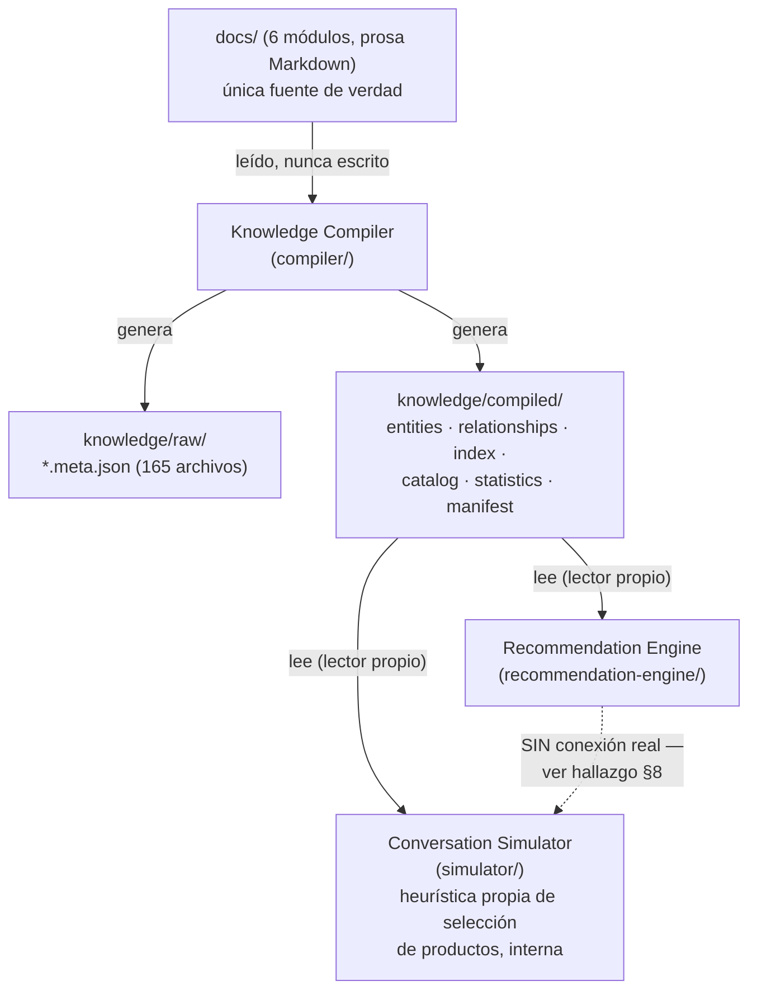

# Arquitectura del Proyecto Vida Divina — Baseline v1.0

> **Estado:** congelado para revisión. Este documento describe la arquitectura **tal como existe hoy**, verificada contra el código y los datos reales del repositorio. No describe la arquitectura deseada ni la planeada — eso vive en la sección 12 (Roadmap arquitectónico).
>
> **Fecha de corte:** compilación verificada `2026-08-07T09:35:11.919Z` (`knowledge/compiled/manifest.json`), 165 entidades, 1886 relaciones, 0 errores, 11 advertencias.
>
> Este documento no modifica ningún componente existente (`docs/KNOWLEDGE_MODEL.md`, `compiler/`, `recommendation-engine/`, `simulator/` permanecen intactos). Es una síntesis nueva.

---

## 1. Visión general

Vida Divina es un negocio de venta directa (multinivel) de productos de bienestar. Antes de este proyecto, el conocimiento necesario para atender a un cliente — qué productos existen, para quién sirven, cómo se conversa con un cliente real, qué objeciones aparecen y por qué, en qué orden se decide algo, y cómo debería razonar un agente que participe en ese proceso — no existía documentado en ningún lugar. Vivía, en el mejor de los casos, en la experiencia no escrita de un asesor humano.

El propósito de esta arquitectura es doble:

1. **Convertir ese conocimiento tácito en una base documental explícita, verificable y modular** (`docs/`), organizada de forma que un agente — humano o de IA — pueda cargar únicamente lo que necesita para un momento concreto de la conversación, sin tener que leer el negocio completo.
2. **Demostrar, mediante implementación real y no solo diseño, que esa base documental es suficiente** para sostener un flujo de decisión completo: descubrir conocimiento, compilarlo a una forma consultable, y usarlo para producir una recomendación de producto y una simulación de conversación coherentes con las reglas documentadas.

El alcance de la versión 1.0, tal como existe hoy, es exactamente ese: **una base de conocimiento en Markdown + un compilador que la transforma en datos estructurados + dos motores de decisión (Recomendación y Simulación de Conversación) validados de forma independiente entre sí.**

Explícitamente **fuera de alcance de v1.0** (no implementado, no simulado parcialmente, no probado):

- Ningún modelo de lenguaje ni proveedor de IA participa en ningún componente de código. Todo el razonamiento de `compiler/`, `recommendation-engine/` y `simulator/` es reglas y transcripción determinista.
- No existe base de datos. Toda persistencia es archivos planos (`.md`, `.json`) en disco.
- No existe servidor, API HTTP, ni ningún proceso de larga duración. Cada componente es un script que se ejecuta una vez y termina.
- No existe integración con ningún canal real (WhatsApp u otro). El "cliente" en `simulator/` es un string de texto pasado por argumento de línea de comandos.
- No existe memoria persistente entre turnos de conversación (cada corrida del simulador es un turno aislado).
- No existe un componente que orqueste `recommendation-engine/` y `simulator/` juntos — ver el hallazgo central de la sección 8.

---

## 2. Principios arquitectónicos (solo los demostrados)

Cada principio listado aquí fue puesto a prueba por al menos una implementación real, no solo declarado. Se cita la evidencia.

**1. Markdown en `docs/` es la única fuente de verdad.**
Evidencia: en los tres sprints de código (Knowledge Compiler, Conversation Simulator, Recommendation Engine) se verificó por checksum, después de cada entrega, que ningún archivo de `docs/` había sido modificado. `compiler/src/artifacts.js` contiene una guardia en tiempo de ejecución (`assertNeverWritesToDocs()`) que lanza una excepción si cualquier ruta de escritura cae bajo `docs/`.

**2. Compilación unidireccional.**
Evidencia: `knowledge/` se regenera por completo en cada corrida del compilador (172 ms la última vez) y nunca es leído por el propio compilador como entrada. Ni `recommendation-engine/` ni `simulator/` escriben en `knowledge/`; solo lo leen.

**3. Separación estricta entre conocimiento y ejecución.**
Evidencia: `docs/` no contiene una sola línea de código ejecutable. `compiler/`, `recommendation-engine/` y `simulator/` no contienen una sola frase de contenido de negocio (ni un nombre de producto, ni un texto de conversación) — todo el contenido vive citado por referencia a un archivo de `docs/`.

**4. No inventar información.**
Evidencia repetida: en `simulator/`, cuando no existe un precio, testimonio, recurso o promoción real, el sistema devuelve una lista vacía y registra un "hallazgo" en vez de generar un valor plausible (`getRecursosDeApoyo()`, `getTestimonios()`, `getPromociones()`, `getPrecio()` en `simulator/src/knowledgeQuery.js`, las cuatro con 0 instancias reales en `docs/`). En `recommendation-engine/`, las relaciones producto→perfil que no encajan en ninguna de las tres secciones clasificables no se descartan ni se les asigna una categoría inventada: se reportan aparte como `sinClasificar`.

**5. La seguridad tiene prioridad absoluta sobre la recomendación.**
Evidencia: en `simulator/src/intentDetector.js`, la señal médica (`SENAL_MEDICA`) se evalúa antes que cualquier señal de perfil o de precio. El caso de prueba de una señal médica (diabetes) nunca llegó a la etapa de consulta de productos — el flujo se detuvo en el paso correspondiente, tal como exige `docs/agente_ia/prioridades.md` (Seguridad = prioridad 1).

**6. Ninguna regla de código se escribe sin una fuente documental citada.**
Evidencia: cada tabla de reglas en `simulator/src/rules.js` y `simulator/src/stateMachine.js`, y cada entrada de `compiler/src/config.js` (`SECCION_A_TIPO_RELACION_PRODUCTO`, `FILENAME_ENTITY_OVERRIDES`, etc.) lleva un comentario que cita el archivo y sección exactos de `docs/` que transcribe.

**7. Toda inferencia no explícita en la fuente se declara como tal, no se presenta como regla del negocio.**
Evidencia: `recommendation-engine/src/categories.js` documenta explícitamente que el mapeo de "primer producto listado en una sección → PRIMARY, el resto → OPTIONAL" es una inferencia de orden, no una regla preexistente en `docs/clientes/`. La categoría `PRIMARY` de un cliente con dos productos en "Productos recomendados" depende del orden en que aparecen en el Markdown — un hecho editorial, no necesariamente una decisión de negocio.

**8. Un módulo, una responsabilidad.**
Evidencia: seis módulos de conocimiento independientes en `docs/` (`productos`, `clientes`, `conversaciones`, `objeciones`, `proceso_de_venta`, `agente_ia`), y tres componentes de código independientes (`compiler/`, `recommendation-engine/`, `simulator/`), cada uno con su propio `package.json`, ejecutable por separado, sin importar código entre sí salvo lectura de `knowledge/compiled/`.

**9. La compilación nunca se detiene por advertencias; solo por errores estructurales que no ocurrieron aún.**
Evidencia: la corrida vigente registra 11 advertencias (`relacion_no_verificable`, todas hacia anclas de `CLAUDE.md`, fuera de `docs/`) y 0 errores; el pipeline completó sus 10 pasos igualmente.

**10. Independencia del proveedor de IA.**
Evidencia: los tres componentes de código funcionan de principio a fin sin llamar a ningún modelo de lenguaje ni servicio externo — la "inteligencia" de v1.0 es en su totalidad reglas explícitas y transcripción documental, no inferencia estadística. (Matiz honesto: esto demuestra que el sistema *no depende* de una IA, no que ya fue probado *integrado* con una — ver Componentes pendientes, sección 7.)

---

## 3. Componentes oficiales

Existen seis componentes reconocidos en v1.0. El primero (`docs/`) no es un artefacto de código, sino la base documental; el segundo (Knowledge Model) es un contrato de diseño, no un programa; el tercero (Knowledge Package) es un artefacto de datos regenerable; los últimos dos (Recommendation Engine, Conversation Simulator) son los únicos programas ejecutables con lógica de decisión de negocio.

### 3.0 Base de Conocimiento de Negocio (`docs/`)

- **Propósito:** contener, en prosa estructurada, todo el conocimiento de negocio necesario para atender a un cliente.
- **Responsabilidad:** ser la única fuente de verdad de contenido — productos, perfiles de cliente, conversaciones reales, objeciones, proceso comercial y especificación cognitiva del agente.
- **Entradas:** edición humana directa (o autorizada explícitamente por sprint).
- **Salidas:** los propios archivos `.md` — consumidos exclusivamente por el Knowledge Compiler.
- **Dependencias:** ninguna.
- **Contratos públicos:** convenciones estructurales de las que depende el compilador — nombres de archivo por módulo, encabezados `## ` en `docs/clientes/*.md` (`Productos recomendados`, `Productos complementarios`, `Productos que NO son prioridad`), y la excepción documentada de que `docs/productos.md` es el índice del módulo `productos/` pese a vivir fuera de esa carpeta.
- **Qué conoce:** todo el contenido de negocio actualmente documentado (66 productos agrupados en 61 entidades, 16 perfiles de cliente, 37 conversaciones, 4 objeciones analizadas, proceso comercial y especificación cognitiva).
- **Qué NO conoce:** nada de ejecución — no hay una sola línea de código en este componente.

### 3.1 Knowledge Model (`docs/KNOWLEDGE_MODEL.md`)

- **Propósito:** ser el contrato conceptual que define qué entidades y relaciones existen en el conocimiento del negocio y cómo deben representarse.
- **Responsabilidad:** especificar el esquema (entidades, relaciones, metadatos, capas `raw/`/`compiled/`) — no contener datos de negocio, no ejecutarse.
- **Entradas:** análisis manual de `docs/` (no tiene entradas en tiempo de ejecución; es un documento, no un programa).
- **Salidas:** el propio documento — usado como especificación de referencia por quien implementa o extiende el Knowledge Compiler.
- **Dependencias:** ninguna técnica.
- **Contratos públicos:** el esquema de entidades (§3, §7 del documento) y la definición de Knowledge Package (§11), que el Knowledge Compiler debe cumplir.
- **Qué conoce:** la estructura conceptual completa de las seis capas de `docs/`, incluida la entidad `Resource` (definida pero sin datos reales que cargar — ver sección 7).
- **Qué NO conoce:** el contenido real de ningún producto o perfil; no valida ni ejecuta nada.
- **Estado:** Iteración 2, congelado — no modificado desde su última revisión de arquitectura, verificado por checksum en cada sprint posterior.

### 3.2 Knowledge Compiler (`compiler/`)

- **Propósito:** transformar `docs/` (prosa) en `knowledge/` (datos estructurados consultables), siguiendo el contrato del Knowledge Model.
- **Responsabilidad:** descubrir módulos y documentos, clasificar entidades, extraer metadatos, detectar referencias, construir relaciones, validar, generar artefactos, estadísticas y manifiesto — un pipeline de 10 pasos.
- **Entradas:** el árbol de archivos `docs/**/*.md`.
- **Salidas:** `knowledge/raw/**/*.meta.json` (165 archivos espejo), `knowledge/compiled/{index,entities,relationships,catalog,statistics,manifest}.json`, `knowledge/logs/{compilation,errors,warnings}.log`.
- **Dependencias:** Node.js puro (`node:fs`, `node:path`, `node:crypto`, `node:url`, `node:child_process`), sin librerías externas. Lee `docs/`; nunca escribe ahí (garantizado en código).
- **Contratos públicos:** el formato exacto de los seis archivos JSON de `knowledge/compiled/` — cualquier consumidor (`recommendation-engine/`, `simulator/`) depende de que esta forma no cambie sin aviso.
- **Qué conoce:** la estructura de carpetas de `docs/`, las convenciones de nombre de archivo por módulo, los encabezados `## ` de `docs/clientes/*.md` (desde Sprint 3B), la excepción de `docs/productos.md` como índice externo de su módulo.
- **Qué NO conoce:** el significado semántico de la prosa — no hace procesamiento de lenguaje natural, no entiende "qué es un buen producto"; clasifica y relaciona por convención estructural (nombre de archivo, carpeta, posición del encabezado más cercano), nunca por contenido interpretado.
- **Última corrida verificada:** 165 entidades, 1886 relaciones, 0 errores, 11 advertencias, 172 ms.

### 3.3 Knowledge Package (`knowledge/`)

- **Propósito:** ser el contrato de datos entre "lo ya compilado" y cualquier componente consumidor.
- **Responsabilidad:** separar `raw/` (un `.meta.json` por documento fuente, espejo de `docs/`, aún sin contenido propio más allá de metadatos extraídos) de `compiled/` (los índices agregados y las relaciones ya resueltas).
- **Entradas:** generado exclusivamente por el Knowledge Compiler.
- **Salidas:** consumido por Recommendation Engine y Conversation Simulator — cada uno con su propio lector independiente.
- **Dependencias:** depende en un 100% del Knowledge Compiler para existir o actualizarse; no se edita a mano en ningún caso.
- **Contratos públicos:** `entities.json` (agrupado por `tipo_entidad`), `relationships.json` (lista plana `origen_id`/`destino_id`/`tipo_relacion`/`seccion`), `manifest.json` (metadatos de la corrida, incluida la marca `git_commit: null`, ver riesgos).
- **Qué conoce:** exactamente lo que el compilador logró extraer de `docs/` en su última corrida — nada más.
- **Qué NO conoce:** si está desactualizado respecto a la última edición de `docs/`. No existe ningún mecanismo automático que detecte esa divergencia; depende de que alguien recuerde recompilar (ver riesgos, sección 10).

### 3.4 Recommendation Engine (`recommendation-engine/`)

- **Propósito:** dado un perfil de cliente ya identificado, ordenar los productos relacionados con él por categoría de prioridad.
- **Responsabilidad única:** clasificar en `PRIMARY` / `COMPLEMENTARY` / `OPTIONAL` / `NOT_RECOMMENDED` — nada de selección de recursos, nada de generación de texto de conversación, nada de detección de intención del cliente.
- **Entradas:** un `perfilId` (string, ej. `clientes/descanso_sueno`) + `knowledge/compiled/`.
- **Salidas:** `{ porCategoria, ordenPresentacion, sinClasificar }` — estructura clasificada y ordenada.
- **Dependencias:** solo lee `knowledge/compiled/` (vía su propio lector, `recommendation-engine/src/knowledgeLoader.js`, deliberadamente **no compartido** con `compiler/` ni con `simulator/`, para que el motor pueda moverse o eliminarse sin afectar a los otros dos). No importa nada de `compiler/` ni de `simulator/` en tiempo de ejecución — confirmado por inspección directa del código (`grep` sin resultados sobre ambos módulos).
- **Contratos públicos:** `recomendarProductos(kb, perfilId)`.
- **Qué conoce:** las relaciones tipadas `perfil→producto` ya compiladas (`recomienda_primario`, `recomienda_opcional`, `recomienda_complementario`, `no_recomendado`).
- **Qué NO conoce:** no sabe identificar un perfil a partir de un mensaje de cliente (esa es responsabilidad exclusiva del Conversation Simulator); no conoce recursos, testimonios ni precios.
- **Última validación:** 6 perfiles (4 reutilizados de los casos ya resueltos por el Conversation Simulator en el Sprint 3A, 2 adicionales), 0 excepciones.

### 3.5 Conversation Simulator (`simulator/`)

- **Propósito:** ejecutar el flujo comercial de 7 pasos para un mensaje de cliente dado, validando que la base documental sostiene una conversación completa.
- **Responsabilidad:** detectar estado del cliente, detectar intención, aplicar reglas de calificación y prioridad, consultar el conocimiento compilado, seleccionar productos a mencionar, construir un borrador de respuesta, determinar el siguiente estado.
- **Entradas:** un mensaje de texto de cliente (string) pasado por línea de comandos, o uno de 6 casos fijos predefinidos.
- **Salidas:** una traza estructurada de decisiones + un borrador de respuesta + el estado siguiente + una lista de "hallazgos" (campos faltantes detectados en esa corrida).
- **Dependencias:** `knowledge/compiled/` (vía su propio lector independiente, `simulator/src/knowledgeLoader.js`) + tablas de reglas transcritas a mano dentro del propio componente (`simulator/src/rules.js`, `simulator/src/stateMachine.js`).
- **Contratos públicos:** `simularConversacion(kb, nombreCaso, mensaje)`.
- **Qué conoce:** heurísticas de texto para detectar intención (señal médica, señal de precio, señal de emprendimiento, señales de perfil — 16 filas transcritas), el mapa de 10 estados del cliente, las reglas de prioridad del proceso comercial.
- **Qué NO conoce, y esto es una decisión de estado actual, no un límite de diseño:** el Conversation Simulator **no distingue `PRIMARY` de `COMPLEMENTARY` ni de `OPTIONAL`.** Su selección de productos (`simulator/src/knowledgeQuery.js`, función `getProductosRecomendados()`) usa una heurística propia — "los primeros N productos referenciados en el perfil" — construida en el Sprint 3A, **antes de que existiera el Recommendation Engine.** El propio código de esa función se autodocumenta como "una heurística de orden, no una relación semántica real" y registra un hallazgo cada vez que se ejecuta. El Recommendation Engine (Sprint 3B) fue construido específicamente para resolver esta limitación — pero los dos componentes nunca fueron conectados entre sí. Ver sección 8 para el detalle de este hallazgo, el más importante de este documento.
- **Última corrida verificada:** 6 de 6 casos completados sin excepciones, 5 hallazgos únicos registrados.

---

## 4. Flujo arquitectónico (el real, no el idealizado)



Puntos que este diagrama deja explícitos y que un diagrama "de intención" habría ocultado:

- `docs/` alimenta a un único componente, el Knowledge Compiler. Ningún otro componente lee `docs/` directamente en tiempo de ejecución.
- `Recommendation Engine` y `Conversation Simulator` son **hermanos, no una cadena.** Ambos leen `knowledge/compiled/` de forma independiente, con lectores de código distintos y no compartidos. No existe ninguna llamada de uno hacia el otro.
- La línea punteada entre ambos representa la conexión que **debería existir conceptualmente** (el motor de recomendación alimentando la selección de productos del simulador) pero que **no existe en el código actual.**

---

## 5. Contratos entre componentes

| Productor | Artefacto | Formato | Consumidor(es) | Regla de dependencia |
|---|---|---|---|---|
| `docs/` | archivos `.md` | Markdown + convenciones de nombre/encabezado | Knowledge Compiler (único) | Ningún componente de código escribe en `docs/`. Garantizado en `compiler/src/artifacts.js` con una excepción en tiempo de ejecución si se intenta. |
| Knowledge Compiler | `knowledge/raw/*.meta.json` | JSON, un archivo por documento fuente | (sin consumidor activo todavía en v1.0; espejo preparatorio) | Solo el compilador escribe aquí. |
| Knowledge Compiler | `knowledge/compiled/*.json` (6 archivos) | JSON | Recommendation Engine, Conversation Simulator | Ambos consumidores leen, nunca escriben. Ninguno de los dos lee `docs/` directamente — dependencia exclusiva del artefacto compilado. |
| Recommendation Engine | `{ porCategoria, ordenPresentacion, sinClasificar }` | objeto JS en memoria (no persistido a disco) | Nadie todavía — ver hallazgo §8 | No existe import cruzado entre `recommendation-engine/` y `simulator/`, verificado por inspección directa del código en ambas direcciones. |
| Conversation Simulator | traza de decisión + borrador de respuesta + hallazgos | objeto JS en memoria / salida de consola | Nadie todavía (no hay Conversation Runtime) | Igual que el anterior: aislamiento total respecto a `recommendation-engine/`. |

Reglas de dependencia que rigen a todos los componentes por igual:

- Ningún componente de código depende de un modelo de lenguaje, una API externa o una base de datos.
- Ningún componente lee `docs/` directamente salvo el Knowledge Compiler.
- `knowledge/` nunca se edita a mano — solo se regenera.
- Cada componente de código tiene su propio `package.json` y puede ejecutarse de forma aislada sin que los otros existan (siempre que `knowledge/compiled/` ya se haya generado al menos una vez).

---

## 6. Arquitectura del conocimiento

El recorrido real del conocimiento, desde que se escribe hasta que se usa en una decisión, es:

```
docs/ (prosa)
   │  (Knowledge Compiler: descubrir → clasificar → extraer → referenciar → relacionar → validar)
   ▼
knowledge/compiled/ (datos estructurados)
   │
   ├──▶ Recommendation Engine   (consumidor independiente #1)
   │
   └──▶ Conversation Simulator  (consumidor independiente #2, con lógica propia de selección de producto)
```

Es importante ser preciso aquí: el flujo **no es** `docs → Compiler → Package → Recommendation Engine → Conversation Simulator` como una tubería secuencial única. Esa sería la lectura idealizada, y no corresponde a lo implementado. Lo que existe en v1.0 son **dos ramas paralelas e independientes** que consumen el mismo Knowledge Package sin comunicarse entre sí. La sección 8 explica por qué esto importa y qué se necesitaría para cerrarlo.

Dentro de `knowledge/compiled/`, el conocimiento queda organizado en:

- **Entidades** (165 total): 61 productos —cifra a interpretar con cautela, ver Hallazgo 2 en §8: 7 de estas 61 son en realidad archivos de categoría, no productos individuales—, 16 perfiles, 37 conversaciones, 15 índices de categoría, 9 documentos cognitivos, 8 documentos de proceso, 6 índices de módulo, 4 objeciones, 2 reglas de decisión, 1 regla de seguridad, 1 estado de cliente, 1 etapa de proceso, 1 herramienta, 1 métrica, 1 principio, 1 ejemplo de razonamiento.
- **Relaciones** (1886 total): 1625 genéricas (`referencia`), 137 estructurales (`pertenece_a_categoria`, derivadas de la jerarquía de carpetas), y 124 relaciones tipadas de recomendación (`recomienda_primario`: 16, `recomienda_opcional`: 49, `recomienda_complementario`: 54, `no_recomendado`: 5) — estas últimas cuatro son las únicas que el Recommendation Engine sabe interpretar; todas las demás las trata como "sin clasificar" si su destino es un producto.

---

## 7. Componentes pendientes (descritos, no implementados)

Ninguno de los siguientes existe hoy en código. Se describen porque su ausencia ya fue detectada durante la construcción de v1.0, no porque se estén anticipando funcionalidades nuevas.

**Decision Engine / Orchestrator.**
El componente que realmente conectaría `Recommendation Engine` y `Conversation Simulator` (y, más adelante, `Resource Engine`) en un solo flujo de decisión coherente. Hoy cada uno se valida por separado, con datos de entrada preparados a mano (`recommendation-engine/main.js` reutiliza los `perfilId` que el Conversation Simulator ya había resuelto en el Sprint 3A, pero como una lista estática copiada, no como una llamada en tiempo de ejecución). Sin este componente, cualquier inconsistencia entre lo que el simulador dice y lo que el motor de recomendación diría para el mismo perfil queda sin resolver.

**Resource Engine.**
Selección de recursos de apoyo, testimonios y promociones reales para acompañar una recomendación. Bloqueado no solo por falta de código: la entidad `Resource`, ya definida en el Knowledge Model (§3), tiene **cero instancias reales** en `docs/` hoy. No tiene sentido construir un motor de selección sobre un tipo de dato vacío.

**Conversation Runtime.**
La versión con estado persistente del Conversation Simulator — memoria real entre turnos de una misma conversación, en vez de una ejecución aislada por mensaje. `docs/agente_ia/memoria.md` ya especifica cómo debería comportarse esa memoria a nivel cognitivo; no existe implementación.

**Fuente operativa de precios.**
Detectado como hallazgo en el Sprint 3A (`getPrecio()` en `simulator/src/knowledgeQuery.js` siempre devuelve vacío porque no hay una sola cifra de precio en `docs/`) y nunca resuelto. No es un problema de código: es la ausencia de una fuente de datos real (probablemente fuera de `docs/`, ej. un sistema de inventario/CRM).

**Modelo de Promoción.**
Mencionado como hallazgo en el Sprint 3A y referenciado de nuevo en el Sprint 3B; no tiene todavía ni esquema en el Knowledge Model ni datos.

**Integración de canal real (WhatsApp u otro).**
No hay ningún adaptador de entrada/salida hacia un canal de mensajería. El "cliente" en v1.0 es siempre un argumento de línea de comandos.

---

## 8. Hallazgos arquitectónicos

Ordenados por relevancia, con la evidencia que los sostiene.

**Hallazgo 1 — Recommendation Engine y Conversation Simulator no están integrados, pese a que el segundo fue la causa directa de construir el primero.**
El Sprint 3B (Recommendation Engine) se originó explícitamente de una observación hecha durante el Sprint 3A: el caso de "Insomnio" mostró que la heurística de "primeros N productos" del simulador no distinguía prioridad real entre Sleep N' Lose, Eterno y Orange Genius. El Recommendation Engine se construyó para resolver exactamente ese problema — y lo resuelve, de forma validada, de manera aislada. Pero `simulator/src/knowledgeQuery.js` nunca fue modificado para usarlo (correctamente, dado que el Sprint 3B tenía restricción explícita de no tocar el Conversation Simulator). El resultado es que, hoy, **ambos componentes pueden dar respuestas distintas para el mismo perfil**, y de hecho las dan: el simulador seguirá devolviendo "primeros N productos por orden de aparición" mientras el motor de recomendación ya sabe clasificar correctamente PRIMARY/COMPLEMENTARY/OPTIONAL para ese mismo perfil. Esta es la brecha arquitectónica más importante de v1.0.

**Hallazgo 2 — "1 archivo = 1 entidad" subestima el catálogo real de productos, y reapareció de forma independiente tres veces.**
Detectado primero en el Sprint 2 (`KNOWLEDGE_COMPILER_NOTES.md`), confirmado de nuevo en el Sprint 3A, y confirmado una tercera vez en el Sprint 3B con el caso concreto de Salud Visual. Siete archivos de categoría en `docs/productos/` agrupan 2–3 productos mediante anclas HTML (`<a id="...">`) internas que el compilador no separa en sub-entidades. El catálogo real tiene 66 productos; el sistema compilado reconoce 61 entidades de tipo `producto`. Que el mismo síntoma haya emergido en tres sprints distintos, sin relación directa entre sí, es la evidencia más fuerte de que este es el hallazgo con mayor prioridad de resolución (ver Roadmap, sección 12).

Una cuarta confirmación, más precisa, llegó durante la Auditoría Final de Versionado (RC1): esos mismos siete archivos de categoría no solo agrupan varios productos sin separarlos — además quedaron clasificados en `knowledge/compiled/entities.json` con `tipo_entidad: "producto"` en lugar de `indice_categoria`. Es decir, **la cifra "61 productos" incluye 7 entidades que no son productos individuales, sino contenedores de categoría** (`04-funcion-cognitiva`, `05-dolor-articulaciones`, `06-salud-visual`, `07-rendimiento-fisico`, `08-intimidad-libido`, `09-proteinas-batidos`, `12-cuidado-personal`) — solo 54 de las 61 corresponden a un producto real e individual. El mismo mecanismo produce relaciones duplicadas cuando un perfil de cliente enlaza a dos anclas distintas dentro del mismo archivo de categoría (confirmado en `clientes/perder_peso` → `productos/09-proteinas-batidos`, con 311 de 1484 combinaciones únicas origen/destino/tipo apareciendo más de una vez sobre 1886 relaciones totales). Cualquier cifra de "61 productos" citada en este documento o en `docs/PROJECT_STATE.md` debe leerse con esta precisión.

**Hallazgo 3 — La relación Perfil→Objeción nunca se formalizó, y su ausencia fue detectada en tres momentos distintos también.**
Señalada como brecha conceptual en `KNOWLEDGE_MODEL.md` (§13), señalada de nuevo como brecha técnica en `KNOWLEDGE_COMPILER_NOTES.md` (#5), y confirmada implícitamente por el Conversation Simulator, que no tuvo forma de anticipar qué objeción es más probable para un perfil dado — nunca se le pidió hacerlo porque el conocimiento para hacerlo no existe de forma relacional.

**Hallazgo 4 — La decisión "archivo paralelo sobre frontmatter" (Knowledge Model, Iteración 2) se sostuvo en la práctica.**
No es una afirmación de diseño: en los tres sprints de código posteriores a esa decisión, se modificaron y validaron 165 archivos de metadatos sin tocar una sola vez el contenido original de los 165 `.md` de `docs/`. Es la evidencia empírica de que la decisión cumplió su propósito.

**Hallazgo 5 — Nunca se echó en falta una base de datos de grafos.**
La decisión de rechazar un Knowledge Graph implementado como grafo real (Knowledge Model §6) nunca generó fricción en la práctica: cada corrida del compilador (172 ms sobre 165 documentos y 1886 relaciones) resolvió sus consultas con estructuras en memoria (`Map`) sin necesidad de travesías multi-hop ni de un motor de consultas dedicado.

**Hallazgo 6 — La sección "Kits recomendados" de `docs/clientes/*.md` no tiene datos enlazables en ningún perfil.**
Detectado durante el Sprint 3B al construir `SECCION_A_TIPO_RELACION_PRODUCTO`: de los 16 perfiles, ninguno tiene un enlace real de Markdown bajo ese encabezado (0/16), pese a que el encabezado existe en la plantilla. No se implementó una relación para esa sección porque no hay datos que la ejerciten.

---

## 9. Deuda técnica aceptada

Únicamente la deuda reconocida explícitamente en algún documento de cierre de sprint. No se listan aquí ideas nuevas.

- **Agrupación de productos por archivo, no por entidad real** (61 vs. 66) — aceptada en el Sprint 2, reconfirmada en Sprints 3A y 3B (ver Hallazgo 2).
- **Sin validación automática de anclas Markdown** (`#anchor`) — los enlaces internos se construyen manualmente siguiendo las reglas de slug de GFM, sin una herramienta que verifique que el ancla de destino existe.
- **Vocabulario de relaciones incompleto respecto al Knowledge Model.** El compilador emite hoy 6 tipos de relación (`referencia`, `pertenece_a_categoria`, `recomienda_primario`, `recomienda_opcional`, `recomienda_complementario`, `no_recomendado`); el Knowledge Model (§4) contempla un vocabulario semántico más amplio (ej. `deriva_hacia`, `tiene_diálogo`) que no tiene todavía extracción automática.
- **Clasificación de entidades por convención de nombre de archivo/carpeta, no por análisis de contenido.**
- **Sin cache incremental** — cada compilación reprocesa los 165 documentos completos; `knowledge/cache/` existe solo como scaffold documentado, sin lógica.
- **`git_commit` siempre `null`** en el manifiesto — el repositorio no tiene ningún commit (confirmado hoy: `git log` reporta que la rama `main` no tiene historial).
- **Recommendation Engine y Conversation Simulator sin integrar** — deuda aceptada explícitamente en `docs/RECOMMENDATION_ENGINE.md` (§9, recomendación 4): "no conectarlos todavía es una decisión de arquitectura pendiente", a la espera de esta misma revisión.
- **Lectores de `knowledge/compiled/` duplicados** — `compiler/`, `recommendation-engine/` y `simulator/` implementan cada uno su propia lógica de lectura de JSON, en vez de compartir una librería común. Aceptado deliberadamente en el Sprint 3B para mantener aislamiento total entre componentes.
- **Cobertura parcial de `NOT_RECOMMENDED`** — solo 4 de 16 perfiles tienen contenido real bajo "Productos que NO son prioridad".
- **Cero pruebas automatizadas** en `compiler/`, `recommendation-engine/` y `simulator/` — toda la validación hecha hasta ahora fue ejecución manual de casos y verificación humana de la salida.

---

## 10. Riesgos arquitectónicos (observados, no teóricos)

- **Ausencia total de historial de versiones.** El repositorio tiene 8 archivos con cambios sin confirmar y cero commits desde el inicio del proyecto. Este no es un riesgo hipotético: ya se ha operado durante cuatro sprints de código sin ningún punto de reversión posible ante un error.
- **Desincronización silenciosa entre `docs/` y `knowledge/`.** No existe ningún mecanismo que detecte automáticamente cuándo `knowledge/compiled/` quedó desactualizado respecto a la última edición de `docs/`. En la práctica, cada sprint tuvo que recordar manualmente recompilar antes de validar — ya ocurrió que el olvido de este paso habría producido resultados obsoletos si no se hubiera verificado a mano.
- **Reglas transcritas a mano pueden divergir silenciosamente de su fuente.** `simulator/src/rules.js` y `simulator/src/stateMachine.js` son transcripciones manuales de `docs/proceso_de_venta/reglas_de_decision.md` y `docs/proceso_de_venta/estados_del_cliente.md`. Si esos documentos cambian, nada en el sistema detecta ni alerta que el código transcrito quedó desalineado — riesgo ya señalado explícitamente en `docs/CONVERSATION_SIMULATOR.md`.
- **Doble fuente de verdad para "qué producto recomendar".** Consecuencia directa del Hallazgo 1: hoy existen dos rutas de código capaces de responder "¿qué producto recomiendo para este perfil?" (`simulator/src/knowledgeQuery.js` y `recommendation-engine/src/recommendationEngine.js`), y ya se verificó que pueden divergir para el mismo perfil. Este riesgo es real y actual, no proyectado.

---

## 11. Decisiones congeladas

Lista consolidada y autoritativa. Cambiar cualquiera de estas decisiones requiere una revisión de arquitectura explícita (Architecture v2, ver criterios en la sección 13), no una corrección puntual dentro de un sprint.

1. `docs/` en Markdown es la única fuente de verdad; ningún componente de código escribe ahí.
2. La compilación es unidireccional: `docs/` → `knowledge/`, nunca al revés.
3. Separación estricta entre conocimiento (`docs/`) e implementación (`compiler/`, `recommendation-engine/`, `simulator/`).
4. Metadatos estructurados mediante archivo paralelo (`.meta.json`), no frontmatter YAML embebido en el `.md`.
5. Sin base de datos, sin motor de grafos, sin embeddings, sin modelo de lenguaje en ninguno de los componentes de v1.0.
6. Node.js sin dependencias externas como runtime único de todos los componentes de código, **excepto el driver PostgreSQL (`pg`) utilizado exclusivamente por `crm/`** (excepción aprobada en la Fase B del CRM/Customer 360 — ver `docs/CRM_FASE_B_POSTGRESQL.md`). Ningún otro módulo está autorizado a importar `pg` ni ningún otro driver de base de datos; `crm/` es la única puerta de acceso a PostgreSQL (`crm/index.js`, que tampoco expone el pool ni ninguna función de query genérica a quien lo importe).
7. Un componente, una responsabilidad — ningún componente absorbe la responsabilidad de otro (el Recommendation Engine no detecta intención; el Conversation Simulator no clasifica prioridad de producto de forma semántica).
8. Toda regla de decisión transcrita a código debe citar su fuente documental exacta.
9. Ninguna categorización o relación se inventa; lo no verificable se declara como hallazgo, nunca se rellena con un valor plausible.
10. La señal de seguridad (médica) tiene prioridad absoluta sobre cualquier recomendación de producto.
11. Todo hallazgo de arquitectura se documenta antes de corregirse — ningún sprint corrige silenciosamente lo que un sprint anterior encontró, sin una revisión explícita que lo autorice.
12. `knowledge/` es en su totalidad regenerable y desechable — nunca debe contener información que no pueda reconstruirse a partir de `docs/`.

---

## 12. Roadmap arquitectónico

Este roadmap ordena **evolución de arquitectura**, no funcionalidades de producto. El orden está justificado por dependencia real entre pasos, no por prioridad de negocio.

**1. Higiene de repositorio: primer commit.**
Prerrequisito de costo mínimo, señalado de forma independiente en la auditoría técnica (Fase 1), en `KNOWLEDGE_COMPILER_NOTES.md` y de nuevo en este documento (sección 10). Es el primer paso porque todo lo demás en este roadmap implica cambios de código o de esquema que hoy no tienen punto de reversión.

**2. Resolver "1 archivo = 1 entidad" (Hallazgo 2).**
Es el hallazgo con más apariciones independientes (tres) de todo el proyecto. Se ubica antes que cualquier otro cambio de esquema porque todo motor construido encima de `knowledge/compiled/entities.json` (incluidos los dos ya existentes) hereda hoy un conteo de productos incorrecto (61 en vez de 66).

**3. Formalizar en el Knowledge Model las relaciones tipadas perfil→producto que el compilador ya emite.**
`recomienda_primario`/`recomienda_opcional`/`recomienda_complementario`/`no_recomendado` existen hoy en `compiler/src/config.js` sin haber sido incorporadas formalmente al vocabulario de `docs/KNOWLEDGE_MODEL.md` — documentado como pendiente en `docs/RECOMMENDATION_ENGINE.md`. Se ubica antes del siguiente paso porque el Decision Engine debería construirse sobre un contrato ya formalizado, no sobre una implementación de facto.

**4. Diseñar el Decision Engine / Orchestrator que conecte Recommendation Engine y Conversation Simulator (Hallazgo 1).**
Este es el paso que cierra la brecha arquitectónica más importante detectada en este documento. Se ubica después de los pasos 2 y 3 porque conectar dos motores sobre un catálogo de entidades incompleto (paso 2) y un vocabulario de relaciones no formalizado (paso 3) propagaría esos mismos defectos a la integración.

**5. Resource Engine, solo cuando exista al menos un dato real de tipo `Resource` en `docs/`.**
No tiene sentido de ingeniería construir un motor de selección sobre un conjunto de datos vacío (0 instancias hoy).

**6. Conversation Runtime (memoria persistente entre turnos).**
Depende de que exista primero un Decision Engine (paso 4) capaz de producir una decisión coherente por turno; sin eso, dar memoria a un sistema que puede contradecirse a sí mismo entre Recommendation Engine y Conversation Simulator amplificaría la inconsistencia, no la resolvería.

**7. Fuente operativa de precios y de promociones.**
Es una integración de datos externa al proyecto (no un problema de arquitectura interna), y no bloquea a ninguno de los pasos anteriores — se ubica al final porque ninguno de los componentes actuales depende de tener precios para funcionar correctamente en su alcance actual.

**8. Integración de canal real (WhatsApp u otro).**
Deliberadamente el último paso: cualquier integración con un canal real antes de resolver los pasos 1–6 expondría a un cliente real a las inconsistencias ya documentadas en este baseline.

---

## 13. Criterios para Architecture v2

Esta sección no diseña v2. Enumera qué evidencia, si se observa, justificaría abrir una revisión formal de arquitectura — no una corrección de sprint.

- **Evidencia de que la desconexión entre Recommendation Engine y Conversation Simulator genera respuestas contradictorias en un uso real** (no solo simulado) — recolectada al construir el Decision Engine (Roadmap, paso 4) y encontrar que la integración exige un cambio de contrato, no solo una llamada de función.
- **Evidencia de que el volumen real de datos supera lo que un índice JSON plano puede sostener** — medida (tiempos de compilación, tamaño de archivo), no anticipada. Hoy: 165 entidades, 1886 relaciones, 172 ms — sin ninguna señal de que esto sea un límite práctico.
- **Evidencia recolectada desde conversaciones reales de que las reglas SI/ENTONCES transcritas no cubren casos que sí ocurren en la práctica** — no una sospecha, sino casos documentados que las tablas actuales de `simulator/src/rules.js` no resuelven.
- **El primer commit de Git ya realizado, más al menos un ciclo de uso real** (no simulado) que produzca datos que contradigan alguna de las decisiones congeladas de la sección 11.
- **Datos reales de tipo `Resource` o de `Promoción` ya existentes en `docs/`** — recién ahí hay algo concreto que justifique diseñar el esquema y el motor correspondientes, en vez de diseñar sobre un vacío.

---

## Cierre

Este documento describe la arquitectura de Vida Divina exactamente como fue verificada el 2026-08-07: una base de conocimiento en Markdown, un compilador que la transforma en datos estructurados sin nunca escribir de vuelta, y dos motores de decisión — Recomendación y Simulación de Conversación — que funcionan correctamente cada uno por separado pero que **no están conectados entre sí**, pese a que el segundo fue la razón original para construir el primero. Esa desconexión (Hallazgo 1) es, junto con la fragmentación del catálogo de productos (Hallazgo 2) y la ausencia de historial de Git (Riesgo, sección 10), la prioridad más clara para cualquier trabajo futuro.

No se ha modificado ningún componente existente para producir este documento. No se inicia ningún desarrollo nuevo. Se espera revisión arquitectónica antes de abrir la siguiente fase del proyecto.

---

## Adendum — cierre posterior a v1.0 (commit `7391271`, 2026-08-07)

> Este baseline permanece **congelado tal como está descrito arriba** — nada de lo anterior se reescribió ni se corrigió en silencio (Decisión congelada §11.11: "todo hallazgo se documenta antes de corregirse"). Este adendum registra qué cambió *después* del cierre de v1.0, en el mismo commit que resolvió los pasos 1–4 del Roadmap (§12): primer commit de Git, granularidad del catálogo, formalización del vocabulario de relaciones, y Decision Engine. El detalle narrativo completo vive en el mensaje del commit `7391271`; aquí solo se deja el registro arquitectónico.

**Hallazgo 1 — cerrado.** `decision-engine/` (nuevo componente, `decision-engine/src/decisionEngine.js` + `decision-engine/main.js`) conecta Recommendation Engine y Conversation Simulator sin modificar ninguno de los dos — respeta la restricción original del Sprint 3B. Su función `decidir(nombreCaso, mensajeCliente)` corre el simulador, y si la intención resuelta es `perfil_identificado` (y el perfil no es `clientes/emprendimiento`, rama que el propio simulador ya excluye de recomendación de producto), invoca al Recommendation Engine, compara el primer producto que cada uno habría ofrecido, y usa la clasificación del Recommendation Engine (PRIMARY primero) como fuente final — declarando explícitamente `fuenteDeDecision` y, si hubo discrepancia, el detalle de qué habría dicho cada uno. Verificado: 6/6 casos de `decision-engine/main.js` ejecutados sin excepciones (`node decision-engine/main.js`).
>
> Matiz honesto: esto resuelve la desconexión, no la elimina de la base de código. `simulator/src/knowledgeQuery.js` conserva su heurística propia de "primeros N productos" y sigue siendo invocable de forma aislada (el propio Decision Engine la usa como primer paso, vía `simularConversacion`); lo que cambió es que ahora existe un componente que las concilia en vez de dejarlas sin resolver. La doble fuente de verdad sigue siendo un riesgo válido si algo invoca al simulador *sin* pasar por el Decision Engine — ver §10.

**Hallazgo 2 — cerrado.** El Knowledge Compiler ahora separa los 7 archivos de categoría de producto único en su contenedor (`indice_categoria`) más un producto real por bloque de ancla — el catálogo compilado pasa de 61 a **66 entidades de tipo `producto`**, coincidiendo con el catálogo real. Última corrida verificada: **177 entidades, 1898 relaciones, 0 errores, 11 advertencias** (`knowledge/compiled/manifest.json`, `2026-08-07T10:54:26.779Z`) — reemplaza la cifra "165 entidades, 1886 relaciones" citada en el resto de este documento (§0, §3.2, §6), que queda como registro histórico de la corrida anterior al fix.

**Deuda aceptada §9 — actualizada:**
- "Agrupación de productos por archivo, no por entidad real" → resuelta, ver Hallazgo 2 arriba.
- "Vocabulario de relaciones incompleto respecto al Knowledge Model" → resuelta: `docs/KNOWLEDGE_MODEL.md` fue sincronizado con el vocabulario que el compilador ya emitía (`recomienda_primario`, `recomienda_opcional`, `recomienda_complementario`, `no_recomendado`), incluyendo una ADR sobre el rol de `.meta.json` como Capa 1 de solo salida.
- "`git_commit` siempre `null`" → resuelta: el repositorio tiene historial (`d1eb7d1`, `7391271`); el manifiesto registra el commit vigente en el momento de compilar.
- "Recommendation Engine y Conversation Simulator sin integrar" → resuelta, ver Hallazgo 1 arriba.
- **Deuda nueva, introducida por este mismo cierre:** `decision-engine/` no tiene pruebas automatizadas ni un documento de cierre de sprint dedicado (a diferencia de `KNOWLEDGE_COMPILER_IMPLEMENTATION.md`, `CONVERSATION_SIMULATOR.md`, `RECOMMENDATION_ENGINE.md`) — su única evidencia hoy es la ejecución manual de 6 casos.

**Riesgos §10 — actualizados:**
- "Ausencia total de historial de versiones" → resuelto.
- El resto de los riesgos listados en §10 (desincronización silenciosa `docs/`↔`knowledge/`, reglas transcritas a mano sin detección de divergencia) **siguen vigentes sin cambios** — este cierre no los tocó.

**Roadmap §12 — pasos 1 a 4 completados.** Ver `docs/PROJECT_STATE.md` §11 para el detalle actualizado y la recomendación de próxima fase (cerrar la deuda nueva de `decision-engine/`, luego construir Conversation Runtime — paso 6, ya desbloqueado).

**Criterios para Architecture v2 (§13) — primer criterio cumplido parcialmente.** El primer criterio listado ("evidencia de que la desconexión... genera respuestas contradictorias... recolectada al construir el Decision Engine") ya tiene evidencia: la conciliación (`compararSeleccion` en `decisionEngine.js`) confirma que el simulador y el Recommendation Engine *pueden* divergir para el mismo perfil (campo `discrepancia.hayDiferencia`), aunque en los 6 casos de prueba actuales no lo hicieron. Esto no dispara todavía una revisión formal de Architecture v2 — la integración se logró como conciliación en tiempo de ejecución, sin exigir un cambio de contrato entre componentes, que era la condición que el criterio original anticipaba.
