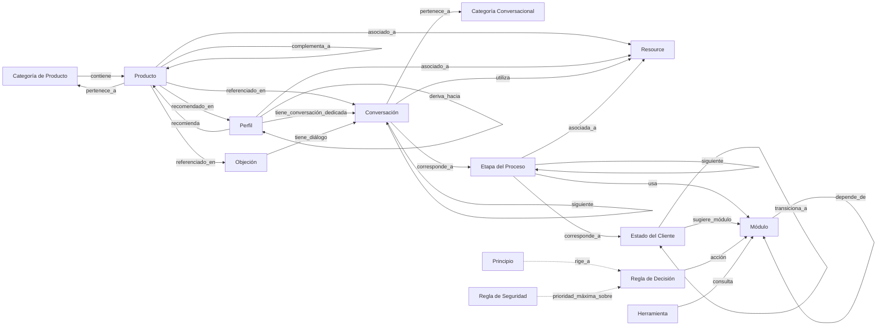

# Vida Divina — Knowledge Model
## Fase 2 · Sprint 1 · Documento de Arquitectura — Iteración 2 (pendiente de revisión — no implementar)

**Estado:** Propuesta para revisión, iteración 2. Incorpora los ajustes de la Architecture Review — Iteración 1 (Resource, revisión de metadatos, Knowledge Package). Este documento no debe usarse como base de implementación hasta que sea aprobado explícitamente.
**Rol de quien escribe esto:** Arquitecto Principal — este documento es diseño conceptual y lógico, no código, no un esquema ejecutable, no un catálogo nuevo.
**Fuente de análisis:** los 165 archivos de `docs/` (productos, clientes, conversaciones, objeciones, proceso_de_venta, agente_ia), `CLAUDE.md`, `docs/FASE_1_AUDITORIA_TECNICA.md` y la retroalimentación de la Architecture Review — Iteración 1. Ningún archivo existente fuera de este documento fue modificado.

---

## 1. Objetivo del Knowledge Model

### Qué problema resuelve

Hoy, el conocimiento de Vida Divina existe como **prosa organizada en archivos Markdown enlazados por convención humana** (rutas relativas, nombres de sección, tablas). Eso funciona muy bien para que una persona — o una IA leyendo archivo por archivo — navegue el sistema, pero tiene un límite: **las relaciones entre entidades son implícitas**, viven dentro del texto y de la disciplina de quien escribió cada archivo, no en una estructura declarada y verificable. No hay forma de preguntar, sin leer 66 archivos uno por uno, "¿qué productos recomienda el perfil Energía?" de forma programática — hay que abrir `docs/clientes/energia.md` y leer la sección "Productos recomendados".

El Knowledge Model resuelve esto **sin tocar la prosa existente**: define qué entidades y relaciones existen realmente en la documentación, para que en una fase posterior (no en esta) un compilador pueda extraerlas de forma determinista y producir una representación consultable — sin que la fuente de verdad deje de ser el Markdown que ya existe.

### Qué papel tendrá dentro del proyecto

Es el **contrato** entre cuatro cosas que hoy no tienen forma de comunicarse entre sí de manera confiable:

1. La documentación humana (`docs/`) — seguirá siendo la única fuente de contenido.
2. Un futuro **Knowledge Compiler** — que transforma esa documentación en una representación consultable, siguiendo exactamente el modelo aquí definido.
3. El **Runtime / Orquestador** — la futura implementación de `docs/proceso_de_venta/` y `docs/agente_ia/` como comportamiento ejecutable.
4. **Cualquier modelo de IA futuro** (Claude, GPT, Gemini, o lo que venga) — que consuma el conocimiento compilado sin necesitar entender la estructura de carpetas de Markdown ni el estilo de escritura del proyecto.

### Qué componentes dependerán de él

- El Knowledge Compiler (no existe todavía) — este documento es su especificación de entrada/salida.
- Las herramientas conceptuales ya definidas en `docs/agente_ia/herramientas.md` (`buscar_cliente()`, `buscar_producto()`, `buscar_objecion()`, `buscar_conversacion()`, `buscar_proceso()`) — hoy son conceptuales; este modelo es lo que las haría implementables de forma consistente.
- Cualquier integración futura (MCP, CRM, automatizaciones — ver roadmap de `CLAUDE.md`) — todas leerían el conocimiento a través de esta forma, no releyendo Markdown crudo cada vez.

---

## 2. Principios de diseño

| Principio | Qué significa aquí | Por qué importa para este proyecto específico |
|---|---|---|
| **Fuente única de verdad** | El Markdown en `docs/` sigue siendo lo único que un humano edita. Cualquier representación compilada (índices, JSON) es un artefacto **derivado y regenerable**, nunca editado a mano. | Si existieran dos lugares donde "la verdad" pudiera vivir (el Markdown y una base de datos editada aparte), el proyecto perdería exactamente la disciplina anti-duplicación que sostuvo toda la Fase 1. Un artefacto compilado que se vuelve a generar desde cero no puede "desincronizarse" de forma permanente — a lo sumo queda desactualizado hasta la próxima compilación. |
| **Separación entre conocimiento e implementación** | El *qué* (productos, perfiles, reglas) vive en `docs/`. El *cómo se ejecuta* (compilador, runtime, agente) es código que todavía no existe y que este documento no escribe. | Es la misma separación que ya sostiene `docs/agente_ia/` (que define comportamiento sin implementarlo) — se extiende aquí al conocimiento estructurado. |
| **Independencia del modelo de IA** | El modelo no asume que el consumidor final es Claude, ni que tiene acceso a herramientas de function-calling, ni a un driver de base de datos específico. | El proyecto ya se diseñó para "Claude, ChatGPT, Gemini, LangGraph, n8n, MCP o cualquier otra plataforma" (`docs/agente_ia/README.md`). Un modelo lógico que dependa de una tecnología de consulta específica rompería esa independencia para cualquier consumidor que no la soporte. |
| **Escalabilidad** | El modelo debe seguir funcionando igual de bien con 66 productos que con 600, sin cambiar de forma. | La escala real hoy (66 productos, 16 perfiles, ~200 archivos) es pequeña. El diseño debe ser honesto sobre eso: escalar no significa "elegir la tecnología más grande posible ahora", significa que crecer 10x no debería requerir rediseñar el modelo — solo generar más instancias de las mismas entidades. |
| **Versionado** | Todo artefacto de este modelo (Markdown, metadatos, índices compilados) debe poder vivir dentro de Git como texto plano, diffable línea por línea. | La auditoría de Fase 1 ya identificó que el proyecto no tiene ni un commit todavía. Cualquier pieza de este modelo que no sea texto plano versionable repetiría ese mismo riesgo en una forma nueva. |
| **Reutilización** | La misma fuente compilada debe poder alimentar consumidores distintos (un MCP tool, un prompt de sistema, un futuro dashboard) sin necesitar una versión distinta del conocimiento para cada uno. | Evita que "los datos para el agente de WhatsApp" y "los datos para un futuro CRM" diverjan silenciosamente en dos copias distintas del mismo conocimiento. |

---

## 3. Inventario de entidades

Entidades **reales**, descubiertas analizando los 165 archivos — no la lista de ejemplo del enunciado original. Se marcan explícitamente las que **no existen todavía** en la documentación, para no inventar cobertura que no hay.

### Entidades centrales (con archivos dedicados hoy)

| Entidad | Cardinalidad actual | Dónde vive |
|---|---|---|
| **Módulo** | 6 (productos, clientes, conversaciones, objeciones, proceso_de_venta, agente_ia) | Cada uno es una carpeta de `docs/` con su propio `README.md` |
| **Producto** | 66 | `docs/productos/**/*.md` |
| **Categoría de Producto** | 13 | Carpetas/archivos dentro de `docs/productos/` |
| **Perfil (de cliente)** | 16 | `docs/clientes/*.md` |
| **Conversación (escenario de ejemplo)** | ~37 construidas | `docs/conversaciones/**/*.md` |
| **Categoría Conversacional** | 9 (primer_contacto, descubrimiento, recomendación, objeciones, seguimiento, cierre, postventa, emprendimiento, plantillas) | Subcarpetas de `docs/conversaciones/` |
| **Objeción** | 9 identificadas, 4 con análisis completo | `docs/objeciones/*.md` (análisis) + `docs/conversaciones/objeciones/*.md` (diálogo) |
| **Etapa del Proceso (macro)** | 14 | `docs/proceso_de_venta/flujo_general.md` |
| **Estado del Cliente** | 10 | `docs/proceso_de_venta/estados_del_cliente.md` |
| **Regla de Decisión** | Múltiples tablas SI/ENTONCES, en dos capas distintas (ver nota abajo) | `docs/proceso_de_venta/reglas_de_decision.md` (capa de negocio) y `docs/agente_ia/reglas_de_decision.md` (capa cognitiva) |
| **Principio** | 7 (inmutables) | `docs/agente_ia/principios.md` |
| **Regla de Seguridad** | Varias, sin numeración fija | `docs/agente_ia/reglas_de_seguridad.md` |
| **Herramienta (conceptual)** | 5 (`buscar_cliente`, `buscar_producto`, `buscar_objecion`, `buscar_conversacion`, `buscar_proceso`) | `docs/agente_ia/herramientas.md` |
| **Métrica** | 6 de resultado + 3 de disciplina del sistema | `docs/agente_ia/metricas.md` |
| **Ejemplo de Razonamiento** | 5 | `docs/agente_ia/ejemplos.md` |
| **Resource** *(nueva en esta iteración)* | 0 instancias creadas — entidad estructural sin datos todavía | No existe archivo dedicado todavía en `docs/` |

> **Nota sobre "Regla de Decisión":** el proyecto ya distingue explícitamente dos capas con el mismo nombre de archivo pero responsabilidades distintas — una de contenido de negocio (qué módulo consultar) y otra de postura cognitiva (pausar/avanzar/preguntar). El modelo de conocimiento debe tratarlas como **el mismo tipo de entidad con un atributo `capa` distinto** (`negocio` | `cognitiva`), no como dos entidades separadas — ver §7.

### Resource (entidad nueva — Ajuste 1 de la Architecture Review)

Durante la revisión se identificó que Audio, Video, Imagen y PDF no debían modelarse como cuatro entidades independientes, sino como una única entidad raíz **Resource**, con el formato como atributo, no como tipo de entidad.

**Por qué Resource debe ser una entidad de primer nivel, y no cuatro entidades separadas:**

1. **Evita duplicar el esquema relacional por razones puramente de formato.** Audio, Video, Imagen y PDF compartirían exactamente el mismo conjunto de relaciones (perfil relacionado, producto relacionado, etapa del proceso, etiquetas, estado, versión) — modelarlos por separado repetiría ese esquema cuatro veces sin ninguna diferencia de significado, violando el mismo principio de "Fuente única de verdad" (§2) que ya rige el resto del modelo.
2. **Desacopla el conocimiento del formato físico**, que es exactamente la intención señalada en el ajuste. El agente, según su propio [`flujo_de_razonamiento.md`](./agente_ia/flujo_de_razonamiento.md), razona sobre *qué necesita* en cada paso — nunca sobre en qué archivo físico vive eso. Una entidad `Resource` con un atributo `tipo` convierte la pregunta de "¿qué video envío?" en "¿qué recurso corresponde aquí?", con el formato como un dato de la respuesta, no como la pregunta misma.
3. **Es consistente con la identidad ya definida del agente** (`docs/agente_ia/identidad.md`): un agente "transparente" y "consultivo" no debería tener una rama de decisión distinta por cada formato de archivo.
4. **Permite crecer en formatos sin tocar el modelo.** Un formato nuevo se agrega como un valor más de `tipo`, no como una entidad ni un cambio estructural.

**Esquema propuesto:**

`id, tipo (audio | video | imagen | pdf | documento | enlace | otro), nombre, descripcion, etapa_proceso_id (opcional), perfiles_relacionados[] (opcional), productos_relacionados[] (opcional), etiquetas[], ubicacion (ruta o URL — abstracta respecto a dónde vive físicamente el archivo), estado (borrador | activo | obsoleto), version`

**Caso particular — Testimonio:** no es un formato, es un *tipo de contenido* que puede llegar como texto, audio o video. Con Resource ya definido, Testimonio no necesita ser una entidad propia — se representaría como un `Resource` cuyo `tipo` corresponde al formato en que llegó, más una etiqueta semántica (por ejemplo, en `etiquetas: ["testimonio"]`). **Promoción** sigue siendo un caso distinto (tiene vigencia y condiciones comerciales, no es "contenido" en el mismo sentido) y permanece fuera de alcance, sin entidad propuesta.

**Nota de estado:** hoy no existe ningún archivo de recurso real en el proyecto — el único artefacto remotamente relacionado es el archivo `Recursos` en la raíz del repositorio, que la propia auditoría de Fase 1 (§14) ya señaló como un archivo huérfano de 17 bytes, no un recurso gestionado. Esta entidad se documenta como preparación estructural, no porque exista contenido que modelar hoy.

### Atributos, no entidades independientes (hoy)

| Candidato | Estado real | Nota |
|---|---|---|
| **Ingrediente** | No normalizado | Texto libre dentro de "Ingredientes principales" de cada Producto. No hay lista maestra cruzando productos. |
| **Beneficio** | No normalizado | Texto libre dentro de Producto y de Perfil, sin catálogo propio. |
| **Kit** | No normalizado | Cada Perfil tiene "Kits recomendados", marcado explícitamente como *"sugerencia comercial, no un kit oficial del catálogo"* — prosa, no una entidad con id propio. |
| **Palabra clave** | Parcialmente estructurada | Ya existe como campo "Palabras clave" en cada Producto y Perfil — el candidato más cercano a un atributo indexable ya existente. |

### Entidades que el enunciado original sugería y no existen en absoluto

Verificado explícitamente para no asumir nada — **siguen sin existir instancias reales**:

- **Testimonio, Promoción, Audio, Video, Imagen, PDF** — cero instancias creadas en la documentación actual.

Lo que cambia respecto a la primera versión de este documento: si llegan a crearse, Audio/Video/Imagen/PDF/Documento/Enlace ya no serían candidatos a entidad propia — serían valores del atributo `tipo` de `Resource` (ver arriba). Promoción permanece fuera de alcance, sin cambios.

---

## 4. Relaciones entre entidades

```
Módulo
    ├── depende_de → Módulo                         (ej. agente_ia depende de los otros 5)

Categoría de Producto
    ├── contiene → Producto                          (1:N)

Producto
    ├── pertenece_a → Categoría de Producto           (N:1)
    ├── recomendado_en → Perfil                       (N:M)
    ├── complementa_a → Producto                      (N:M — "productos complementarios")
    ├── referenciado_en → Objeción                    (N:M — "enlaces a productos relevantes")
    ├── referenciado_en → Conversación                (N:M)
    ├── asociado_a → Resource                         (N:M — nueva)

Perfil
    ├── recomienda → Producto                         (N:M, inverso)
    ├── tiene_conversación_dedicada → Conversación     (1:0..1 — hoy solo 5 de 16 perfiles la tienen)
    ├── deriva_hacia → Perfil                          (N:M — "posibles ventas futuras / cross-selling")
    ├── prioridad_de_negocio → (atributo: Alta/Media-Alta/Media/Baja-Media)
    ├── asociado_a → Resource                          (N:M — nueva)
    ├── [gap detectado] objeciones comunes → Objeción  (hoy solo texto libre, sin enlace formal — ver §13)

Conversación
    ├── pertenece_a → Categoría Conversacional          (N:1)
    ├── corresponde_a → Etapa del Proceso (macro)        (N:1, aproximado — no siempre 1:1 exacto)
    ├── relacionada_con → Perfil                        (N:0..1)
    ├── relacionada_con → Producto                       (N:M)
    ├── siguiente → Conversación                         (N:M — "qué hacer después" apunta a otro archivo)
    ├── utiliza → Resource                               (N:M — nueva, opcional)

Objeción
    ├── tiene_diálogo → Conversación                     (1:1, análisis ↔ diálogo)
    ├── relacionada_con → Producto                        (N:M)
    ├── activada_por → (atributo: frases/variantes de texto)

Etapa del Proceso (macro, 14 pasos)
    ├── siguiente → Etapa del Proceso                     (secuencia, con bifurcación en Objeciones/Seguimiento)
    ├── usa → Módulo                                       (N:M — qué módulo se consulta en ese paso)
    ├── corresponde_a → Estado del Cliente                 (N:1 aproximado)
    ├── asociada_a → Resource                              (N:M — nueva, opcional)

Estado del Cliente
    ├── transiciona_a → Estado del Cliente                 (N:M — máquina de estados)
    ├── sugiere_módulo → Módulo                             (N:1..M)

Regla de Decisión
    ├── condición → (atributo: texto "SI...")
    ├── acción → Módulo | Archivo                           ("ENTONCES consultar...")
    ├── capa → (atributo: negocio | cognitiva)

Principio
    ├── rige_a → Regla de Decisión                          (informal — ninguna regla puede contradecir un Principio)

Regla de Seguridad
    ├── prioridad_máxima_sobre → Regla de Decisión           (siempre gana, ver agente_ia/prioridades.md)

Herramienta (conceptual)
    ├── consulta → Módulo                                    (N:1 — cada herramienta apunta a un módulo de conocimiento)

Resource (nueva)
    ├── corresponde_a → Etapa del Proceso                    (N:0..1)
    ├── asociado_a → Perfil                                   (N:M)
    ├── asociado_a → Producto                                 (N:M)
    ├── utilizado_en → Conversación                           (N:M)
```

---

## 5. Grafo de conocimiento

El modelo conceptual **sí es un grafo**: nodos tipados (las entidades de §3) conectados por aristas tipadas y dirigidas (las relaciones de §4). Esto es válido y útil como forma de *pensar* el sistema — la discusión de qué tan lejos llevar esto en la *implementación* está en §6.

### Diagrama (Mermaid)



### Cardinalidades resumidas

| Relación | Cardinalidad | Densidad real hoy |
|---|---|---|
| Producto ↔ Categoría | N:1 | Baja — cada producto tiene exactamente una categoría |
| Producto ↔ Perfil | N:M | Media — cada perfil recomienda 3-8 productos; cada producto aparece en 1-4 perfiles |
| Perfil ↔ Conversación | 1:0..1 | Baja — solo 5 de 16 perfiles tienen conversación de recomendación dedicada hoy |
| Conversación ↔ Conversación (siguiente) | N:M | Media — la relación más "en grafo" del sistema |
| Estado ↔ Estado (transición) | N:M | Baja-Media — 10 estados, cada uno con 1-4 transiciones válidas |
| Módulo ↔ Módulo (dependencia) | N:M | Muy baja — 6 módulos, relación casi lineal |
| Resource ↔ (Perfil / Producto / Conversación / Etapa) | N:M | Nula hoy — 0 instancias; estructural para cuando existan |

### Dependencias entre tipos de nodo

El grafo tiene una jerarquía de dependencia clara, no es una malla plana: `Producto` y `Categoría` no dependen de nada más (son la base); `Perfil` depende de `Producto`; `Conversación` depende de `Perfil` y `Producto`; `Objeción` depende de `Producto` y `Conversación`; `Resource` depende de cualquiera de los anteriores según a qué se asocie, sin ser dependencia de ninguno; `Etapa del Proceso` y `Estado del Cliente` orquestan a los anteriores; `Regla de Decisión`, `Principio`, `Regla de Seguridad` y `Herramienta` están en la capa más alta. Esta jerarquía coincide con la arquitectura de 6 módulos ya documentada en `CLAUDE.md` — el Knowledge Model no introduce una jerarquía nueva, formaliza la que ya existía.

---

## 6. Modelo lógico

**Esta es la sección donde se me invitó explícitamente a no adaptarme a la premisa de "grafo" si no la considero la mejor opción para la implementación — y donde, en esta iteración, también se pidió revisar sin sesgo la decisión de metadatos de la versión anterior.**

### Alternativas evaluadas para la representación física del conocimiento

| Opción | Ventajas | Desventajas para este proyecto específico |
|---|---|---|
| **Base de datos de grafos** (ej. Neo4j) | Consultas multi-hop nativas; buena para relaciones que evolucionan en profundidad | Infraestructura desproporcionada: la consulta real más profunda hoy es de 1-2 saltos. Requiere un servidor con estado propio fuera de Git — rompe **versionado**. Requiere un driver/lenguaje de consulta específico — rompe **independencia del modelo de IA**. |
| **Relacional puro** (ej. SQLite) | Buen ajuste para relaciones N:M reales; consultas simples y rápidas; portable como archivo único | La prosa extensa (diálogos, análisis) queda incómoda en columnas `TEXT`. Un archivo `.sqlite` es binario — no diffable en Git. Requiere driver SQL en el consumidor. |
| **JSON puro** (reemplazando el Markdown) | Máxima portabilidad; cualquier plataforma lo lee sin driver especial | Editar prosa extensa en JSON escapado es hostil para autoría humana. Duplicaría la fuente de verdad si el Markdown se mantuviera en paralelo. |
| **Híbrido: Markdown + metadato + índice compilado** *(recomendado — sin cambios respecto a la iteración anterior en esta decisión de alto nivel)* | Ver detalle abajo | El único costo real es introducir una convención de metadatos nueva — incremental, no disruptiva. |

La conclusión de alto nivel **no cambia** en esta iteración: Markdown como fuente + una capa de metadato estructurado + un índice compilado derivado. Lo que sí se revisa a fondo es **cómo se implementa esa capa de metadato** — ver a continuación.

### Revisión de la Capa 2: ¿Frontmatter o archivo paralelo?

La versión anterior de este documento proponía frontmatter YAML dentro del propio Markdown sin comparar alternativas explícitamente. Este ajuste corrige eso — y **cambia la recomendación**.

| Criterio | Alternativa A — Frontmatter en el Markdown | Alternativa B — Archivo paralelo (`producto.md` + `producto.meta.json`) |
|---|---|---|
| Mantenibilidad | Un solo archivo — sin riesgo de que metadato y contenido se separen físicamente | Riesgo real de archivos huérfanos si un `.md` se renombra/mueve sin su `.meta.json` — mitigable (ver más abajo), pero es un riesgo que Frontmatter no tiene |
| Simplicidad | No agrega archivos nuevos al repositorio | Duplica el conteo de archivos (hasta 165 `.meta.json` adicionales) |
| Automatización | Requiere un parser YAML-frontmatter-aware | Requiere solo un parser JSON — más simple y más universal |
| Regeneración automática | El compilador tendría que editar con precisión solo el bloque superior de un archivo que un humano también edita — riesgo de dañar la prosa por error de parsing | El compilador escribe únicamente el `.json`, nunca toca el `.md` — separación limpia entre lo que un humano edita y lo que una herramienta regenera |
| Compatibilidad con Git | Cada regeneración automática de metadato aparece como un cambio al mismo archivo de contenido — mezcla prosa humana con metadato calculado en el mismo historial | Cada regeneración es un diff aislado al `.json` — el historial de Git de la prosa queda limpio, mostrando solo cambios reales de contenido |
| Facilidad para IA | Cualquier modelo con capacidad de leer Markdown extendido lo interpreta sin problema | Igual de simple o más — JSON es el formato de intercambio más universalmente soportado |
| Facilidad para edición humana | Cómodo si se redacta contenido y metadato a la vez; obliga a convivir con un bloque YAML al inicio del archivo | El `.md` permanece exactamente como es hoy — 100% prosa, cero sintaxis técnica |

**Decisión: se cambia la recomendación de la iteración anterior — la Alternativa B (archivo paralelo) es superior para este proyecto específico**, por tres razones que pesan más que las ventajas de Frontmatter:

1. **Cero modificación a los 165 archivos existentes.** Es la razón de mayor peso: introducir esta capa mediante archivo paralelo no toca ni una línea del contenido ya escrito y verificado durante la Fase 1. Frontmatter requeriría editar los 165 archivos para inyectar un bloque nuevo en cada uno — exactamente el tipo de modificación a documentación ya aprobada que este proyecto ha evitado de forma consistente en cada sprint reciente.
2. **El historial de Git de la prosa queda protegido de ruido generado por herramientas.** Con archivo paralelo, el historial de `tedivina.md` muestra únicamente cambios de contenido real; con frontmatter mostraría también cada regeneración automática de metadato como si fuera un cambio al producto.
3. **Reduce el riesgo para quien mantiene el contenido**, que en este proyecto tiene perfil de negocio, no técnico — mantener los archivos de contenido completamente libres de sintaxis YAML reduce la posibilidad de que una edición manual rompa un bloque de metadato por accidente.

El riesgo principal de esta alternativa (archivos huérfanos por desincronización) ya tiene mitigación planeada: el paso de "validación de referencias" de la estrategia de compilación (§10) se extiende para verificar también que todo `.md` con metadato declarado tenga su `.meta.json` correspondiente, y viceversa.

**Ejemplo ilustrativo (no un cambio real a ningún archivo):**

```
docs/productos/01-control-de-peso/tedivina.md         (sin cambios — contenido humano, prosa pura)
docs/productos/01-control-de-peso/tedivina.meta.json   (nuevo — metadato estructurado, escrito y regenerado por el compilador)
```

```json
{
  "tipo": "producto",
  "id": "tedivina",
  "categoria": "01-control-de-peso",
  "perfiles_relacionados": ["perder_peso", "bienestar_general"],
  "palabras_clave": ["té detox", "limpieza corporal", "pérdida de peso"]
}
```

### Por qué esta opción, con criterios de mantenibilidad, rendimiento, simplicidad y escalabilidad

- **Mantenibilidad:** un solo lugar de edición humana (Markdown, sin tocar); los `.meta.json` y el índice compilado son generados, nunca editados a mano.
- **Rendimiento:** a esta escala (66 productos, 16 perfiles), archivos JSON de pocos KB se cargan y consultan en memoria de forma instantánea — no hay problema de rendimiento que una base de datos resolvería mejor.
- **Simplicidad:** cero infraestructura nueva. No hay servidor, no hay conexión que mantener, no hay credenciales.
- **Escalabilidad:** crecer 10x no cambia la forma del modelo, solo agrega instancias.

### Cuándo sí se justificaría reconsiderar una base de grafos

No es un rechazo categórico — es una decisión de **no ahora**. Si `docs/casos_reales/`, `docs/embudos/` o `docs/crm/` maduran hasta necesitar preguntas genuinamente multi-hop y analíticas, ahí una base de grafos empezaría a pagar su complejidad. El índice compilado propuesto no es un callejón sin salida: como las relaciones ya quedarían explícitas en los `.meta.json`, migrarlas a un grafo real más adelante sería una exportación, no un rediseño.

---

## 7. Metadatos

Atributos propuestos por entidad — esquema conceptual, independiente del formato de archivo elegido en §6.

**Módulo**
`id, nombre, ruta, propósito, estado (completo|parcial|pendiente), dependencias[], responsabilidades_no[]`

**Producto**
`id, nombre_comercial, categoria_id, objetivo_principal, problema_que_resuelve, ingredientes[] (texto libre hoy), beneficios[] (texto libre hoy), presentacion, publico_objetivo, productos_complementarios[], perfiles_relacionados[], palabras_clave[]`

**Categoría de Producto**
`id, nombre, tipo_organizacion (carpeta|archivo_unico), cantidad_productos`

**Perfil**
`id, nombre, descripcion, objetivo_principal, problemas[], motivaciones[], objeciones_comunes[] (hoy texto libre — ver §13), productos_recomendados[], kits_recomendados[] (texto libre), productos_complementarios[], productos_no_prioritarios[], prioridad_negocio (alta|media_alta|media|baja_media), conversacion_dedicada_id (opcional), palabras_clave[]`

**Conversación**
`id, titulo, categoria_conversacional_id, etapa_proceso_id (aproximada), perfil_relacionado_id (opcional), productos_relacionados[], contexto, variantes[], siguiente_paso_id (opcional), resources_utilizados[] (opcional), notas_comerciales`

**Categoría Conversacional**
`id, nombre, cantidad_construidos, cantidad_pendientes, cobertura (completa|parcial|mvp)`

**Objeción**
`id, frase_disparadora[], por_que_surge, como_abordarla, que_evitar, productos_relevantes[], conversacion_dialogo_id, tiene_analisis (booleano)`

**Etapa del Proceso (macro)**
`id, orden, nombre, modulos_a_consultar[], estado_cliente_resultante_id, resources_asociados[] (opcional)`

**Estado del Cliente**
`id, nombre, definicion, como_se_detecta, modulo_prioritario, transiciones_validas[]`

**Regla de Decisión**
`id, capa (negocio|cognitiva), condicion, accion, modulo_destino, archivo_destino`

**Principio**
`id, enunciado, es_inmutable (siempre true), relacionado_con[]`

**Regla de Seguridad**
`id, categoria (nunca_hacer|nunca_decir|cuando_detenerse|derivar_a_profesional), enunciado`

**Herramienta (conceptual)**
`id, nombre_funcion, modulo_consultado, entrada_esperada, salida_esperada, paso_flujo_razonamiento`

**Métrica**
`id, nombre, que_mide, señal_observable, tipo (resultado|disciplina_del_sistema)`

**Resource** *(nueva)*
`id, tipo (audio|video|imagen|pdf|documento|enlace|otro), nombre, descripcion, etapa_proceso_id (opcional), perfiles_relacionados[], productos_relacionados[], etiquetas[], ubicacion, estado (borrador|activo|obsoleto), version`

---

## 8. Índices

| Índice | Responde a | Se construiría a partir de |
|---|---|---|
| **Por producto** | "Dame la ficha completa de X" | `id` único de Producto |
| **Por categoría** | "Qué productos hay en Control de Peso" | `categoria_id` en Producto |
| **Por perfil** | "Qué recomienda el perfil Energía" | `productos_recomendados[]` en Perfil |
| **Por necesidad/padecimiento** | "El cliente dice que está cansado, ¿qué perfil es?" | `palabras_clave[]` en Perfil |
| **Por objeción (frase disparadora)** | "El cliente dice 'está caro', ¿qué archivo aplica?" | `frase_disparadora[]` en Objeción |
| **Por etapa del embudo** | "¿Qué conversaciones aplican al momento de cierre?" | `etapa_proceso_id` en Conversación |
| **Por estado del cliente** | "El cliente está en estado Evaluando, ¿qué módulo toca?" | `estado_cliente_resultante_id` / `modulo_prioritario` |
| **Por recurso** *(nuevo)* | "¿Qué recurso de apoyo corresponde a esta etapa/perfil/producto?" | `etapa_proceso_id` / `perfiles_relacionados[]` / `productos_relacionados[]` en Resource |
| **Por palabra clave general** | Búsqueda libre tipo texto completo | `palabras_clave[]` combinado de Producto + Perfil |

**Nota:** varios de estos índices **ya existen hoy, escritos a mano** (por ejemplo, la tabla señal→perfil en `docs/clientes/README.md`, o la tabla señal→objeción en `docs/proceso_de_venta/reglas_de_decision.md`). El Knowledge Compiler formalizaría lo que hoy ya se mantiene manualmente.

---

## 9. Relaciones cruzadas — rutas de navegación reales

```
Cliente (mensaje real)
  → Perfil                         (vía índice por necesidad, §8)
  → Producto(s) recomendados       (Perfil.productos_recomendados)
  → Conversación de recomendación  (si existe — Perfil.conversacion_dedicada_id)
  → Objeción (si el cliente resiste)
  → Conversación de objeción       (Objeción.conversacion_dialogo_id)
  → Conversación.siguiente_paso    (cierre o seguimiento)

Regla de Decisión (capa cognitiva, agente_ia)
  → Módulo destino
  → Regla de Decisión (capa negocio, proceso_de_venta)
  → Módulo de contenido (clientes / productos / objeciones / conversaciones)

Estado del Cliente
  → transiciones_validas
  → Estado del Cliente siguiente
  → módulo_prioritario asociado a ese nuevo estado

Etapa del Proceso
  → Resource(s) asociados           (Resource.etapa_proceso_id)
  → (el agente decide el recurso según el contexto, no según el formato)
```

La ruta del enunciado original (`Cliente → Perfil → Conversación → Testimonio → Producto → Promoción`) **no es completamente soportable hoy**: `Testimonio` no existe como instancia (aunque ya tiene una forma de representarse vía Resource, ver §3) y `Promoción` no existe como entidad en absoluto. La ruta real termina en `Conversación → Producto`.

---

## 10. Estrategia de compilación (conceptual — sin código)

1. **Recorrido:** el compilador recorre `docs/` completo, archivo por archivo, incluyendo los `.meta.json` paralelos (§6) cuando existan.
2. **Extracción de metadato:** para cada archivo, lee su `.meta.json` paralelo si existe. Para archivos que todavía no lo tengan (adopción incremental — ver §13), lo trata provisionalmente con metadatos vacíos, marcado como *"pendiente de metadato explícito"*, sin fallar.
3. **Validación de referencias:** cada relación declarada se valida contra el conjunto de `id` conocidos — el mismo principio ya aplicado manualmente durante toda la Fase 1, ahora automatizable. Se añade una validación específica de esta iteración: todo `.md` con `.meta.json` declarado debe tener su par, y viceversa — para detectar archivos huérfanos (ver §6).
4. **Emisión de índices:** se generan los archivos de índice de §8, como JSON plano, escritos en `knowledge/compiled/` (ver §11).
5. **Manifiesto de compilación:** se emite un archivo de control con fecha de compilación y referencia al commit de Git del que se generó, también dentro de `knowledge/compiled/`.
6. **Naturaleza de un solo sentido:** el compilador **nunca escribe hacia el Markdown ni hacia `knowledge/raw/`**. Es una transformación unidireccional — fuente → índice compilado — nunca al revés.

---

## 11. Knowledge Package: `raw/` y `compiled/` *(nueva sección — Ajuste 3)*

Define el contrato de salida del Knowledge Compiler de forma explícita. Es una estructura **conceptual y lógica** — no implica mover ni reorganizar ningún archivo existente de `docs/` hoy. `raw/` es, para efectos de este documento, el nombre lógico de lo que hoy ya es `docs/`; esta propuesta no ejecuta ninguna reorganización de carpetas.

```
knowledge/
├── raw/            (= docs/ hoy — conocimiento fuente, humano)
│   ├── productos/
│   ├── clientes/
│   ├── conversaciones/
│   ├── objeciones/
│   ├── proceso_de_venta/
│   ├── agente_ia/
│   └── *.meta.json   (archivos paralelos de metadato, ver §6)
│
└── compiled/       (nuevo — no existe todavía, artefacto derivado)
    ├── indice_productos.json
    ├── indice_perfiles.json
    ├── indice_conversaciones.json
    ├── indice_objeciones.json
    ├── indice_resources.json
    ├── indice_reglas_decision.json
    ├── indice_estados_cliente.json
    └── manifiesto_compilacion.json
```

### `raw/`

**Qué contiene:** todo el conocimiento fuente — el Markdown existente más los `.meta.json` paralelos que se introduzcan. Incluye, conceptualmente, los archivos físicos de cualquier `Resource` futuro (audio, video, PDF) — son insumo humano, no algo que el compilador genera.
**Quién la modifica:** únicamente personas, o una IA actuando bajo instrucción humana explícita (como en cada sprint de este proyecto hasta ahora). El Knowledge Compiler **nunca escribe en `raw/`**.
**Cuándo se regenera:** nunca — no es un artefacto derivado, es la fuente.
**Fuente de verdad:** `raw/` es, sin ambigüedad, la única fuente de verdad de todo el sistema — coincide exactamente con el Principio de Diseño #1 (§2).

### `compiled/`

**Qué contiene:** exclusivamente artefactos derivados — los índices JSON de §8, más el manifiesto de compilación de §10.
**Quién la modifica:** únicamente el Knowledge Compiler. Ningún humano edita un archivo de `compiled/` directamente — un dato incorrecto se corrige en `raw/` y se vuelve a compilar, nunca se parchea el artefacto.
**Cuándo se regenera:** bajo demanda mientras no exista integración continua, y automáticamente en cada cambio a `raw/` una vez exista (hueco ya señalado en la auditoría de Fase 1). Puede borrarse por completo en cualquier momento sin pérdida de conocimiento — es 100% reconstruible desde `raw/`.
**Fuente de verdad:** ninguna, por definición — es una vista derivada. Esto es intencional: si `compiled/` nunca es fuente de verdad, nunca puede competir con `raw/`.

### Consideración abierta (no decidida en este documento)

Si `compiled/` debería versionarse en Git o tratarse como artefacto de build no versionado (regenerado en cada entorno) depende de cómo se despliegue el futuro Runtime — excede el alcance de este documento (no introducir nuevas tecnologías, no diseñar el compilador) y queda explícitamente pendiente de decidir cuando se diseñe el Knowledge Compiler.

---

## 12. Impacto sobre la arquitectura

| Componente futuro | Cómo lo habilita este modelo |
|---|---|
| **Knowledge Compiler** | Este documento es su especificación de entrada (`raw/`, incluyendo `.meta.json`) y salida (`compiled/`, forma de los índices). |
| **Runtime / Orquestador** (`proceso_de_venta/` ejecutable) | Leería directamente los índices de `Regla de Decisión` y `Estado del Cliente` en `compiled/`, en vez de re-parsear Markdown en cada turno. |
| **Agente IA** (`agente_ia/` ejecutable) | Sus herramientas conceptuales (`buscar_cliente()`, etc.) tendrían una implementación trivial sobre `compiled/`. Con Resource ya modelado, una futura sexta herramienta (`buscar_recurso()`) tendría el mismo patrón exacto que las otras cinco — no descrita en `docs/agente_ia/herramientas.md` hoy, y fuera del alcance de este documento modificarla, pero es una extensión natural y de bajo riesgo cuando exista contenido real que buscar. |
| **MCP** | Cada herramienta conceptual se mapea 1:1 a un tool de MCP; la fuente de datos sería `compiled/`, no el sistema de archivos de `docs/` directamente. |
| **Integraciones futuras** (CRM, WhatsApp, embudos) | Consumen `compiled/` sin necesitar entender la estructura de carpetas ni el estilo de escritura del proyecto. |

---

## 13. Riesgos

| Riesgo | Detalle | Mitigación propuesta |
|---|---|---|
| **Costo de adopción de archivos `.meta.json`** | Crear metadato paralelo para 165 archivos existentes es trabajo real. | Adopción incremental por entidad de mayor valor relacional primero (Producto, Perfil); el compilador tolera archivos sin `.meta.json` (§10, paso 2). |
| **Archivos huérfanos** *(riesgo propio de la Alternativa B, no existía en la propuesta de frontmatter)* | Un `.md` renombrado/movido sin su `.meta.json`, o viceversa, produce un par roto y silencioso. | Validación de integridad de pares como parte del compilador (§10, paso 3) — el mismo mecanismo que ya valida referencias cruzadas se extiende a esto. |
| **Desincronización si no se recompila** | Un índice en `compiled/` puede quedar desactualizado si no se regenera tras un cambio en `raw/`. | Mitigado por diseño: el índice siempre es descartable y regenerable; el riesgo real es solo *cuándo* se recompila, no que pueda corromperse de forma permanente. |
| **Relaciones hoy informales (prosa) se formalizan mal** | Por ejemplo, "objeciones comunes" en cada Perfil es hoy texto libre, no una lista de `id` de Objeción. | El esquema trata esos campos como opcionales/nulos hasta que se normalicen explícitamente — un campo vacío es preferible a una relación inventada. |
| **Ambigüedad entre las dos capas de "Regla de Decisión"** | Si el atributo `capa` no se declara explícitamente, el compilador podría mezclarlas. | Hacer `capa` un campo obligatorio (no inferido) para esta entidad específicamente. |
| **`compiled/` versionado sin política clara** | Si se decide comitear `compiled/` a Git sin una regla de cuándo regenerar, puede quedar desactualizado y percibirse como fuente válida por error. | Documentar explícitamente (cuando se decida, ver §11) que `compiled/`, aunque esté en Git, nunca es fuente de verdad — y considerar un timestamp/hash de `raw/` en el manifiesto para detectar cuándo está desactualizado. |
| **Sobre-invertir en tecnología antes de tener consumidor real** | Construir el compilador y los índices sin que exista todavía un agente que los consuma sería trabajo especulativo. | Secuenciar esto después de la prueba de concepto de razonamiento ya recomendada en la auditoría de Fase 1. |

---

## 14. Recomendaciones

**Qué cambiaría:**
- Adoptar archivos `.meta.json` paralelos de forma incremental, empezando por `Producto` y `Perfil`.
- Formalizar la relación `Perfil → Objeción` (hoy solo texto libre) como una lista real de `id` de `docs/objeciones/`.
- Hacer el atributo `capa` obligatorio y explícito en toda entidad `Regla de Decisión`.

**Qué conservaría, sin cambios:**
- El Markdown como fuente de verdad y toda la disciplina de escritura ya establecida.
- La estructura de 6 módulos y sus límites de responsabilidad.
- La decisión de no usar una base de datos de grafos como implementación (§6) — se revisó a fondo en esta iteración y se sostiene.

**Qué simplificaría:**
- Los candidatos no normalizados (`Ingrediente`, `Beneficio`, `Kit`) — normalizarlos solo se justifica ante una necesidad real de consulta cruzada confirmada, no antes.

**Qué mejoraría:**
- Resolver primero el hueco de control de versiones (cero commits, señalado en la auditoría) antes de que un manifiesto de compilación tenga un commit real al que apuntar.
- Decidir la política de versionado de `compiled/` (§11) antes de implementar el compilador, no durante.
- Secuenciar todo esto después de la prueba de concepto de razonamiento ya recomendada en `docs/FASE_1_AUDITORIA_TECNICA.md` (§18, paso 2).

---

## 15. Cambios respecto a la versión anterior

### Qué cambió

1. **Se agregó la entidad `Resource`** como raíz única para contenido multimedia/documental (audio, video, imagen, PDF, documento, enlace), con esquema, justificación y relaciones completas (§3, §4, §5, §7, §8, §9).
2. **Se revirtió la recomendación de Capa 2 de metadatos**: de Frontmatter YAML (v1) a archivo paralelo `.meta.json` (v2) (§6).
3. **Se definió formalmente el Knowledge Package** (`knowledge/raw/` y `knowledge/compiled/`) como el contrato de salida del Knowledge Compiler (nueva §11), con responsabilidades, quién escribe cada capa, cuándo se regenera y cuál es la fuente de verdad.

### Por qué cambió

1. **Resource** se agregó porque modelar Audio/Video/Imagen/PDF como entidades separadas habría duplicado el mismo esquema relacional cuatro veces por razones de formato, no de significado — contradiciendo el propio Principio de Diseño #1 de este documento. Una entidad raíz con `tipo` como atributo resuelve esto y, además, opera el principio ya existente de que el agente razona sobre necesidad, no sobre formato.
2. **Frontmatter → archivo paralelo** cambió porque el análisis comparativo explícito pedido en esta revisión reveló tres costos de Frontmatter que la versión anterior no había puesto en la balanza: requeriría modificar los 165 archivos ya escritos y verificados en Fase 1, ensuciaría el historial de Git de la prosa con cambios generados por herramientas, y mezclaría sintaxis técnica en archivos que mantiene un perfil no técnico. Ninguno de estos tres factores se había evaluado explícitamente en la iteración 1.
3. **Knowledge Package** se formalizó porque la versión anterior mencionaba "un índice compilado" sin definir dónde vive, quién lo escribe, ni qué lo distingue estructuralmente de la fuente — dejando implícito algo que, para sostenerse "durante varios años" (criterio de éxito de este documento), necesitaba ser explícito y verificable, no solo entendido por convención.

### Qué impacto tiene sobre la arquitectura

- **Resource** habilita, sin ningún cambio adicional al modelo, que futuros testimonios, materiales de apoyo o documentos de venta se incorporen sin necesitar una nueva entidad ni una nueva decisión de arquitectura — ya tienen un lugar donde encajar.
- **Archivo paralelo** reduce drásticamente el riesgo de esta transición: la introducción de metadato estructurado puede empezar sin tocar ni un solo archivo de los 165 ya aprobados, lo cual es coherente con la restricción explícita que ha regido cada sprint reciente de este proyecto ("no modificar documentación existente").
- **Knowledge Package** convierte "Fuente única de verdad" de un principio declarado (§2) a una regla operacional verificable: existe una carpeta que nadie más que un humano toca (`raw/`) y una que nadie más que el compilador toca (`compiled/`) — la separación deja de depender solo de la disciplina y pasa a estar estructuralmente reforzada.

### Qué decisiones permanecieron sin cambio

- Los seis Principios de Diseño (§2), íntegros.
- El modelo conceptual de entidades y relaciones (§4-5) en su estructura general — la única incorporación fue Resource, sin remover ni renombrar ninguna entidad existente.
- La conclusión de más alto nivel de §6: Markdown como fuente + metadato + índice compilado, y el rechazo justificado a una base de datos de grafos como implementación — revisada a fondo en esta iteración y sostenida, no solo mantenida por inercia.
- El roadmap del proyecto (`CLAUDE.md`) — no fue tocado, tal como se restringió explícitamente para este sprint.

---

## Cierre

Este documento sigue sin estar enlazado desde `CLAUDE.md` ni desde ningún otro módulo, de forma deliberada — permanece pendiente de revisión y aprobación antes de integrarse formalmente a la arquitectura documentada.

**No se continúa con implementación. Se espera una nueva revisión de arquitectura antes de comenzar la implementación del Knowledge Compiler.**
