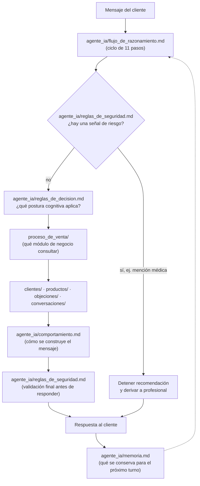

# Agente IA — El Motor Cognitivo de Vida Divina

> Este módulo **no contiene conocimiento del negocio**. No tiene productos, no tiene perfiles de cliente, no tiene diálogos, no tiene objeciones. Define únicamente **cómo debe pensar, razonar y tomar decisiones** un agente de inteligencia artificial especializado en Vida Divina — sin importar si ese agente corre sobre Claude, ChatGPT, la API de OpenAI, Gemini, LangGraph, n8n, MCP o cualquier plataforma futura.
>
> Si buscas *qué* vender, *a quién* o *cómo decirlo*, ese conocimiento vive en `docs/productos/`, `docs/clientes/`, `docs/conversaciones/`, `docs/objeciones/` y `docs/proceso_de_venta/`. Este módulo es el que decide **cómo se usan** esos cinco módulos, turno a turno, dentro de la mente del agente.

---

## Qué es el Motor Cognitivo

Es la especificación de comportamiento del agente: su identidad, sus principios inviolables, su ciclo de razonamiento por cada mensaje, sus reglas de seguridad, qué recuerda y qué no, cómo prioriza, cómo usa sus herramientas de búsqueda, cómo maneja errores, cómo se comporta al hablar, cómo evoluciona con el tiempo y cómo se mide su calidad.

Es **agnóstico de plataforma**: no asume un framework, un lenguaje de programación ni una API concreta. Cualquier implementación futura (un prompt de sistema, un grafo de LangGraph, un flujo de n8n, un servidor MCP) debería poder leer estos 16 archivos y producir el mismo comportamiento.

## Cómo interactúa con los demás módulos

`agente_ia/` es la capa que **envuelve** a los otros cinco módulos, no una capa más al lado de ellos. El agente razona (`agente_ia/`) y, dentro de ese razonamiento, uno de sus pasos es consultar `proceso_de_venta/` — que a su vez orquesta cuándo tocar `clientes/`, `productos/`, `objeciones/` y `conversaciones/`.

```
┌─────────────────────────────────────────────────────────┐
│  agente_ia/   (cómo PIENSA: identidad, principios,       │
│                seguridad, memoria, contexto, prioridades) │
│                                                            │
│   ┌───────────────────────────────────────────────────┐  │
│   │  proceso_de_venta/  (CUÁNDO consultar cada módulo) │  │
│   │                                                     │  │
│   │   clientes/   productos/   objeciones/  conversaciones/ │
│   └───────────────────────────────────────────────────┘  │
└─────────────────────────────────────────────────────────┘
```

**Distinción clave con `proceso_de_venta/flujo_general.md`:** ese archivo describe el recorrido del **cliente** a lo largo de toda la relación (14 pasos, de días a semanas: recepción → fidelización → emprendimiento). El [`flujo_de_razonamiento.md`](./flujo_de_razonamiento.md) de este módulo describe lo que hace la **mente del agente en un solo turno** de conversación (11 pasos, de milisegundos: comprender → responder). Uno es el mapa del viaje; el otro es cómo piensa el guía en cada paso de ese viaje.

## Responsabilidades que SÍ tiene

- Definir la identidad y el tono del agente frente al cliente final.
- Definir principios inviolables y reglas de seguridad.
- Definir el ciclo de razonamiento que se sigue en cada respuesta.
- Definir qué debe recordar y qué debe olvidar dentro de una conversación.
- Definir cómo se cargan los módulos de conocimiento (contexto mínimo necesario).
- Definir cómo se usan las herramientas de búsqueda hacia los demás módulos, sin implementarlas.
- Definir cómo manejar errores, ambigüedad y cambios de tema.
- Definir cómo se mide la calidad del comportamiento del agente.

## Responsabilidades que NO tiene

- No contiene fichas de producto (eso es `docs/productos/`).
- No contiene perfiles de cliente ni sus productos recomendados (eso es `docs/clientes/`).
- No contiene diálogos de ejemplo ni guiones (eso es `docs/conversaciones/`).
- No contiene análisis de objeciones específicas (eso es `docs/objeciones/`).
- No decide *cuándo* consultar cada módulo de negocio (eso es `docs/proceso_de_venta/`) — solo decide que ese paso debe ocurrir dentro de su ciclo de razonamiento.
- No es una guía de venta ni de marketing (eso sigue siendo `CLAUDE.md` a nivel estratégico).

---

## Diagrama general



---

## 📑 Índice de archivos de este módulo

| Archivo | Responde a |
|---|---|
| [`identidad.md`](./identidad.md) | ¿Quién es el agente cuando habla con un cliente? |
| [`principios.md`](./principios.md) | ¿Qué reglas nunca se rompen, pase lo que pase? |
| [`flujo_de_razonamiento.md`](./flujo_de_razonamiento.md) | ¿Qué hace la mente del agente en cada turno, paso a paso? |
| [`reglas_de_decision.md`](./reglas_de_decision.md) | ¿Qué postura cognitiva tomar ante cada situación común? |
| [`reglas_de_seguridad.md`](./reglas_de_seguridad.md) | ¿Qué nunca puede hacer o decir, y cuándo debe detenerse? |
| [`memoria.md`](./memoria.md) | ¿Qué recuerda y qué nunca debe recordar durante una conversación? |
| [`contexto.md`](./contexto.md) | ¿Cómo recupera solo el conocimiento mínimo necesario? |
| [`prioridades.md`](./prioridades.md) | ¿Qué gana cuando dos objetivos entran en conflicto? |
| [`herramientas.md`](./herramientas.md) | ¿Qué capacidades de búsqueda tiene y cuándo usar cada una? |
| [`manejo_de_errores.md`](./manejo_de_errores.md) | ¿Qué hacer ante información faltante, contradictoria o ambigua? |
| [`comportamiento.md`](./comportamiento.md) | ¿Cómo habla, pregunta, confirma, resume y cierra? |
| [`aprendizaje.md`](./aprendizaje.md) | ¿Cómo evoluciona la base de conocimiento sin degradarse? |
| [`metricas.md`](./metricas.md) | ¿Cómo se mide si el agente está razonando bien? |
| [`ejemplos.md`](./ejemplos.md) | ¿Cómo se ve este razonamiento aplicado a casos concretos? |
| [`roadmap.md`](./roadmap.md) | ¿Cómo evolucionará este módulo específico? |

---

## Convenciones heredadas

Este módulo sigue las mismas convenciones definidas en [`CLAUDE.md`](../../CLAUDE.md#convenciones-del-proyecto) (nombres en `snake_case`, rutas relativas, preferir referencias sobre copiar contenido, un archivo = una responsabilidad). No se repiten aquí.

## Notas de mantenimiento

- Si se agrega un archivo nuevo a este módulo, añadirlo a la tabla de índice de este README y a la tabla "Estado Actual del Proyecto" de `CLAUDE.md`.
- Ningún archivo de este módulo debe empezar a describir un producto, un perfil o un diálogo — si eso ocurre, esa información pertenece a otro módulo y debe moverse.
- Ver [`roadmap.md`](./roadmap.md) para cómo se espera que evolucione este módulo específico.
