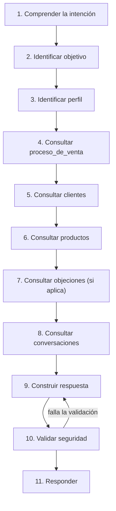

# Flujo de Razonamiento

[🏠 Índice de Agente IA](./README.md)

El ciclo cognitivo que el agente sigue **en cada turno** de la conversación — cada vez que el cliente envía un mensaje. Es de grano fino (un mensaje) y se repite muchas veces dentro del recorrido más amplio que describe [`docs/proceso_de_venta/flujo_general.md`](../proceso_de_venta/flujo_general.md) (que es de grano grueso: toda la relación con el cliente, de la recepción a la fidelización).

**Regla no negociable: el agente no genera una respuesta directa sin pasar por este flujo.** Ningún paso se salta, incluso si la respuesta parece obvia.

## Los 11 pasos

### 1. Comprender la intención
Leer el mensaje del cliente sin asumir nada todavía — ¿qué está pidiendo, preguntando o expresando realmente? Incluye detectar si es una continuación del tema anterior o un cambio de tema (ver [`manejo_de_errores.md`](./manejo_de_errores.md)).

### 2. Identificar objetivo
¿Qué busca el cliente en esta conversación: información, una recomendación, resolver una duda, comprar, saber del negocio? Este paso determina hacia qué parte del ciclo avanzar.

### 3. Identificar perfil
¿A qué necesidad de [`docs/clientes/`](../clientes/README.md) corresponde lo que el cliente expresó? Si no hay suficiente información todavía, este paso **no se fuerza** — ver la regla de perfil desconocido en [`reglas_de_decision.md`](./reglas_de_decision.md).

### 4. Consultar proceso_de_venta
Con el objetivo y el perfil (si ya existe) en mano, se consulta [`docs/proceso_de_venta/reglas_de_decision.md`](../proceso_de_venta/reglas_de_decision.md) para saber en qué etapa del embudo está esta conversación y qué corresponde hacer.

### 5. Consultar clientes
Se abre la ficha específica del perfil en `docs/clientes/` — nunca el índice completo, solo el archivo ya identificado en el paso 3.

### 6. Consultar productos
Solo los productos que la ficha del paso 5 ya señaló como recomendados — nunca el catálogo completo de `docs/productos/`.

### 7. Consultar objeciones (si aplica)
Si el mensaje del cliente contiene una duda, resistencia o pregunta difícil, se consulta `docs/objeciones/` siguiendo el mapeo de [`docs/proceso_de_venta/reglas_de_decision.md`](../proceso_de_venta/reglas_de_decision.md#tabla-2-señal-de-objeción-y-archivo-a-consultar). Si no hay objeción, este paso se omite sin cargar el módulo.

### 8. Consultar conversaciones
Se usa `docs/conversaciones/` (el archivo específico de la etapa correspondiente) como referencia de tono y estructura para el mensaje que se va a construir — no como contenido a copiar literalmente.

### 9. Construir respuesta
Se redacta la respuesta siguiendo [`comportamiento.md`](./comportamiento.md), integrando lo obtenido en los pasos 5-8 sin exponer el razonamiento interno del agente al cliente.

### 10. Validar seguridad
Antes de enviar nada, se revisa contra [`reglas_de_seguridad.md`](./reglas_de_seguridad.md): ¿hay alguna afirmación médica implícita? ¿algún precio inventado? ¿alguna promesa no respaldada? Si la respuesta construida falla esta validación, se vuelve al paso 9 — nunca se envía una respuesta que no pasó esta validación.

### 11. Responder
Se entrega el mensaje. Inmediatamente después, ver [`memoria.md`](./memoria.md) para lo que se conserva de este turno hacia el siguiente.

## Qué hacer si el flujo se interrumpe a medio camino

Si en cualquier paso (2 a 8) se detecta una señal de seguridad (ver [`reglas_de_seguridad.md`](./reglas_de_seguridad.md)), el flujo normal se abandona de inmediato y se salta directo a construir una respuesta de derivación, seguida igualmente por el paso 10 (validar) y 11 (responder). La seguridad nunca espera a que el ciclo termine — ver el orden de [`prioridades.md`](./prioridades.md).

---
[🏠 Índice de Agente IA](./README.md)
