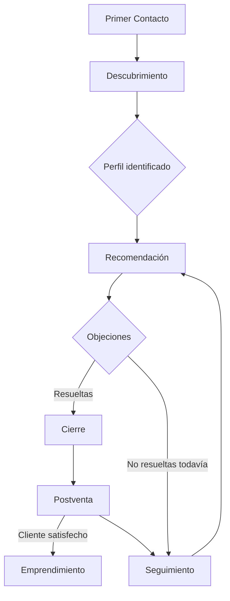

# Base de Conocimiento — Conversaciones Vida Divina

> Biblioteca modular de conversaciones **reales de venta consultiva para WhatsApp**. No son respuestas automáticas ni guiones rígidos: son ejemplos entrenables que muestran *cómo* fluye una conversación consultiva real, basados en los perfiles de [`docs/clientes/`](../clientes/README.md) y los productos de [`docs/productos/`](../productos.md).
>
> Objetivo: que una IA (o un asesor humano) pueda cargar **solo el archivo que necesita** para el momento exacto de la conversación en que se encuentra, sin tener que leer todo el módulo.
>
> Desde esta versión, la carpeta [`objeciones/`](./objeciones/index.md) tiene un módulo hermano en [`docs/objeciones/`](../objeciones/README.md): mientras esta carpeta guarda el **diálogo de ejemplo**, `docs/objeciones/` guarda el **análisis** de cada objeción (por qué surge, cómo pensarla, qué evitar). Ambos se enlazan entre sí.
>
> ¿Buscas cuándo entrar a cada una de estas carpetas y cuándo salir de ellas? Ese criterio de orquestación vive en [`docs/proceso_de_venta/`](../proceso_de_venta/README.md), que decide el paso y usa este módulo para ejecutarlo en lenguaje real.

---

## Alcance de esta primera versión (metodología 80/20)

Este módulo se construyó identificando primero qué escenarios representan la mayor parte de las conversaciones reales, en vez de generar los ~45 escenarios posibles listados en el pedido original desde el día uno. Criterio usado:

- **Recomendación:** se construyeron solo los perfiles de prioridad **Alta** y **Media-Alta** según [`docs/clientes/README.md`](../clientes/README.md#índice-de-perfiles-de-clientes) (Bienestar General, Pérdida de Peso, Energía, Belleza y Anti-Edad, Sistema Inmunológico). Los demás perfiles quedan pendientes y documentados en [`recomendacion/index.md`](./recomendacion/index.md).
- **Objeciones:** se priorizaron las de mayor frecuencia transversal (precio, "lo pienso", "no tengo dinero", escepticismo por experiencias previas) más la objeción médica, priorizada por **riesgo** (una mala respuesta ahí tiene implicación ética/legal), no solo por frecuencia.
- **Primer contacto:** se fusionaron escenarios con el mismo patrón conversacional real (Facebook + "vio una publicación" → un solo archivo `redes_sociales.md`).
- **Seguimiento y Cierre:** se construyeron **completos** (5 de 5 cada uno) porque son cortos, mecánicos, y ocurren en el 100% de las ventas — el costo de completarlos es bajo y el valor es alto.
- **Postventa:** se priorizaron los 3 escenarios de mayor valor comercial (satisfacción, venta cruzada, testimonio).
- **Plantillas:** se fusionaron categorías afines para cubrir las 8 solicitadas en 5 archivos.

Cada carpeta tiene su propio `index.md` que indica qué está construido y qué queda **pendiente** para cuando el negocio lo requiera — la estructura ya está lista para recibir esos archivos sin reorganizar nada.

---

## 🗺️ Mapa de navegación

```
docs/conversaciones/
├── README.md                  ← estás aquí
├── primer_contacto/           → cómo abrir la conversación según el canal de entrada
├── descubrimiento/            → preguntas para identificar el perfil del cliente (nunca recomendar aún)
├── recomendacion/             → cómo presentar productos, ya identificado el perfil
├── objeciones/                → cómo responder dudas y resistencias, sin presión
├── seguimiento/                → mensajes de valor en 24h / 3d / 7d / 15d / 30d
├── cierre/                    → confirmar pedido, pago, envío y agradecer
├── postventa/                 → satisfacción, venta cruzada, testimonios
├── emprendimiento/            → conversaciones sobre la oportunidad de negocio
└── plantillas/                → mensajes reutilizables cortos (saludos, despedidas, etc.)
```

---

## 🔁 Flujo general de una conversación



**En texto:**
1. **Primer contacto** — el cliente escribe por algún canal (referido, redes, WhatsApp directo, pregunta de precio).
2. **Descubrimiento** — se hacen preguntas abiertas para identificar a qué perfil de [`docs/clientes/`](../clientes/README.md) pertenece. **Nunca se recomienda producto en este paso.**
3. **Recomendación** — ya identificado el perfil, se presentan 1-2 productos relevantes de [`docs/productos/`](../productos.md), nunca el catálogo completo.
4. **Objeciones** — se responden dudas sin presión ni urgencia artificial.
5. **Cierre** — se confirma pedido, forma de pago y envío.
6. **Seguimiento** — si el cliente no cierra de inmediato, se le da valor sin invadir, en momentos espaciados (24h/3d/7d/15d/30d).
7. **Postventa** — una vez el cliente recibe el producto, se verifica satisfacción, se resuelven dudas y se identifican oportunidades de venta cruzada o testimonio.
8. **Emprendimiento** — rama paralela: en cualquier momento (usualmente tras una buena experiencia en postventa), se puede abrir la conversación sobre la oportunidad de negocio.

---

## 📑 Índice de módulos

| Carpeta | Contenido | Estado |
|---|---|---|
| [`primer_contacto/`](./primer_contacto/index.md) | Aperturas de conversación según canal de entrada | 4 construidos / 2 pendientes |
| [`descubrimiento/`](./descubrimiento/index.md) | Preguntas para identificar el perfil del cliente | 2 construidos (cobertura completa) |
| [`recomendacion/`](./recomendacion/index.md) | Presentación de producto según perfil | 5 construidos / 11 pendientes |
| [`objeciones/`](./objeciones/index.md) | Respuestas a dudas y resistencias, sin presión | 6 construidos / 3 pendientes |
| [`seguimiento/`](./seguimiento/index.md) | Mensajes de valor en 5 momentos definidos | 5 construidos (cobertura completa) |
| [`cierre/`](./cierre/index.md) | Confirmar pedido, pago, envío y agradecer | 5 construidos (cobertura completa) |
| [`postventa/`](./postventa/index.md) | Satisfacción, venta cruzada, testimonios | 3 construidos / 2 pendientes |
| [`emprendimiento/`](./emprendimiento/index.md) | Conversaciones sobre la oportunidad de negocio | 2 construidos (cobertura MVP) |
| [`plantillas/`](./plantillas/index.md) | Mensajes reutilizables cortos | 5 construidos (cobertura completa) |

---

## Reglas generales (aplican a TODO el módulo)

Para no repetir esto en cada archivo, se centraliza aquí. Cada conversación individual puede referenciar esta sección en vez de reescribirla.

1. **Sin afirmaciones médicas.** Ningún mensaje debe decir que un producto cura, trata o previene una enfermedad. El lenguaje permitido es el mismo del catálogo: "apoya", "ayuda a", "promueve", "contribuye a". Ante cualquier condición médica diagnosticada, la respuesta siempre remite a un profesional de la salud (ver [`objeciones/mi_medico_no_me_deja.md`](./objeciones/mi_medico_no_me_deja.md)).
2. **Sin técnicas de presión.** No se usan urgencias falsas ("solo quedan 2", "oferta termina hoy" si no es cierto), ni culpa, ni insistencia tras un "no" o un silencio. El seguimiento aporta valor, no presiona.
3. **Precios y pagos: no especificado en el catálogo.** El catálogo de producto (`catalogo 2026.pdf`) no incluye precios, formas de pago ni costos de envío. Ninguna conversación de este módulo inventa cifras — todas remiten a "la lista de precios vigente" o "los métodos de pago que manejes en tu negocio", que el asesor debe completar con información real y actualizada.
4. **Cada recomendación enlaza a una fuente real.** Todo producto mencionado enlaza a su ficha en `docs/productos/`; todo perfil mencionado enlaza a su ficha en `docs/clientes/`. No se recomienda nada que no exista en esas fuentes.
5. **El emprendimiento no se fuerza.** Se menciona solo cuando el cliente da una señal de interés o tras una experiencia de producto positiva — nunca en el primer contacto.
6. **Tono:** cercano, natural, de WhatsApp real (mensajes cortos, sin sonar a guion leído). Se evita el lenguaje corporativo o publicitario excesivo.

---

## Cómo usar este módulo (para una IA o un asesor)

1. Identificar en qué momento del embudo está la conversación (ver mapa arriba).
2. Cargar **solo** el archivo de esa carpeta que aplica al caso (por canal, por perfil, por objeción específica, etc.) — no todo el módulo.
3. Si el cliente ya tiene un perfil identificado (por `descubrimiento/`), cruzar con [`docs/clientes/`](../clientes/README.md) para ver productos recomendados, objeciones típicas y argumentos de venta de ese perfil específico.
4. Adaptar el ejemplo al contexto real de la conversación — estos archivos son punto de partida, no texto para copiar y pegar literal.

## Notas de mantenimiento

- Al construir un escenario marcado como "pendiente" en cualquier `index.md`, seguir el formato fijo: `Objetivo / Momento del embudo / Perfil de cliente relacionado / Productos relacionados / Contexto / Conversación ejemplo / Variantes de respuesta / Qué hacer después / Qué NO decir / Notas comerciales`.
- Actualizar la tabla de "Índice de módulos" de este README y el `index.md` de la carpeta correspondiente cada vez que se agregue un archivo nuevo.
- Si `docs/clientes/` o `docs/productos/` cambian (producto nuevo, perfil nuevo), revisar si algún archivo de este módulo necesita actualizarse.
