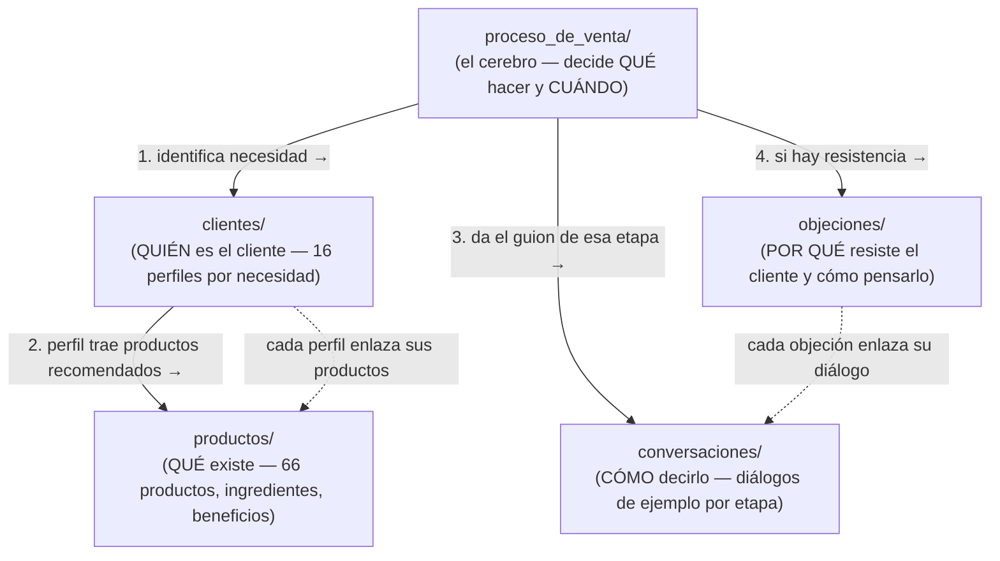
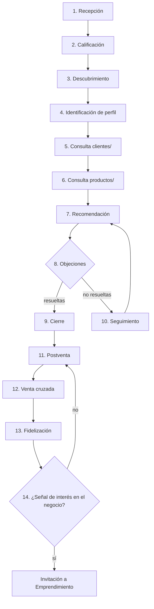

# Proceso de Venta — El Orquestador de Vida Divina

> Este módulo **no contiene** conversaciones ni información de producto. Es el módulo que define **cómo piensa y cómo decide** el sistema comercial de Vida Divina: qué hacer en cada etapa, y a qué otro módulo acudir para ejecutarlo.
>
> Si buscas qué decir, ve a [`docs/conversaciones/`](../conversaciones/README.md). Si buscas qué producto tiene qué ingrediente, ve a [`docs/productos.md`](../productos.md). Si buscas cómo pensar la venta — cuándo calificar, cuándo recomendar, cuándo cerrar, cuándo parar — estás en el lugar correcto.

---

## Qué es y qué no es este módulo

| Este módulo SÍ define | Este módulo NO contiene |
|---|---|
| El orden y las condiciones del proceso comercial | Diálogos de ejemplo (están en `docs/conversaciones/`) |
| Reglas de decisión (SI ocurre X → ENTONCES consultar Y) | Fichas de producto (están en `docs/productos/`) |
| Un modelo de estados del cliente | Perfiles de necesidad detallados (están en `docs/clientes/`) |
| Criterios para calificar, cerrar, dar seguimiento, invitar al negocio | Análisis de objeciones (está en `docs/objeciones/`) |
| Cuándo consultar cada uno de los otros 4 módulos | Contenido duplicado de ningún otro módulo |

Todo archivo de este módulo termina apuntando a otro módulo — nunca resuelve la conversación por sí mismo.

---

## Arquitectura general: los 5 módulos

**Regla de precedencia fija:** `proceso_de_venta` decide el paso → consulta **`clientes` antes que `productos`** (nunca se recomienda un producto sin perfil identificado) → usa `conversaciones` para ejecutar ese paso en lenguaje real → si el cliente resiste, desvía a `objeciones` y regresa al flujo. Ver el detalle completo en [`reglas_de_decision.md`](./reglas_de_decision.md).

---

## Relación con cada módulo

### Relación con `docs/clientes/`
`proceso_de_venta` nunca decide un perfil por su cuenta — usa las señales del cliente para apuntar a un perfil de [`docs/clientes/README.md`](../clientes/README.md), que ya trae su propia lista de productos recomendados, objeciones típicas y prioridad de negocio. La tabla canónica de "señal del cliente → perfil" vive en `docs/clientes/README.md#mapa-rápido-necesidad--primer-producto-de-entrada` — este módulo la referencia, no la repite.

### Relación con `docs/productos/`
Solo se consulta **después** de identificar el perfil en `docs/clientes/`, y solo los productos que ese perfil ya recomienda — nunca el catálogo completo. Ver la regla de precedencia en [`recomendacion.md`](./recomendacion.md).

### Relación con `docs/conversaciones/`
Cada etapa de este módulo (descubrimiento, recomendación, objeciones, cierre, seguimiento, postventa, emprendimiento) tiene su carpeta espejo en `docs/conversaciones/`. `proceso_de_venta` decide *cuándo* entrar a esa carpeta y *bajo qué condición* salir de ella; `docs/conversaciones/` tiene el diálogo real.

### Relación con `docs/objeciones/`
Se consulta cuando el cliente muestra resistencia después de una recomendación (o antes, si la resistencia es filosófica — ej. escepticismo general). Ver el mapeo completo señal→archivo en [`reglas_de_decision.md`](./reglas_de_decision.md) y el criterio de cuándo y cómo volver al flujo en [`manejo_de_objeciones.md`](./manejo_de_objeciones.md).

---

## 🔁 Diagrama del flujo comercial (resumen)

Detalle completo de cada paso (qué módulo consultar, condiciones de entrada/salida) en [`flujo_general.md`](./flujo_general.md).

---

## 📑 Índice de archivos de este módulo

| Archivo | Responde a |
|---|---|
| [`flujo_general.md`](./flujo_general.md) | ¿Cuál es el recorrido completo de una venta, paso a paso? |
| [`calificacion_del_cliente.md`](./calificacion_del_cliente.md) | ¿Qué tan listo está este cliente para comprar (frío/tibio/caliente)? |
| [`descubrimiento.md`](./descubrimiento.md) | ¿Qué información hace falta antes de poder recomendar algo? |
| [`recomendacion.md`](./recomendacion.md) | ¿Cómo se elige qué producto ofrecer, y en qué orden se consultan los módulos? |
| [`manejo_de_objeciones.md`](./manejo_de_objeciones.md) | ¿Cuándo se consulta `docs/objeciones/` y cómo se retoma el flujo después? |
| [`cierre.md`](./cierre.md) | ¿Cuándo es correcto intentar cerrar, y cuándo NO? |
| [`seguimiento.md`](./seguimiento.md) | ¿Qué mensaje de seguimiento corresponde según el estado del cliente? |
| [`postventa.md`](./postventa.md) | ¿Cuándo ofrecer un complementario, pedir testimonio o pedir referido? |
| [`emprendimiento.md`](./emprendimiento.md) | ¿Cuándo tiene sentido invitar a la oportunidad de negocio? |
| [`reglas_de_decision.md`](./reglas_de_decision.md) | **La tabla maestra SI/ENTONCES** — el archivo más consultado de este módulo. |
| [`estados_del_cliente.md`](./estados_del_cliente.md) | ¿En qué punto del proceso está este cliente ahora mismo, y a dónde puede pasar? |
| [`SPRINT_5_PROCESO_COMERCIAL.md`](./SPRINT_5_PROCESO_COMERCIAL.md) | **Fuente de verdad del proceso comercial real** de Vida Divina, extraída directamente del propietario. |
| [`seguimiento_postventa.md`](./seguimiento_postventa.md) | ¿Qué seguimiento postventa se usa realmente hoy (día 3, +1 semana)? |
| [`recuperacion_de_compra.md`](./recuperacion_de_compra.md) | Proceso nuevo de recuperación de compra potencial a los 5 días. |
| [`pago_y_pedido.md`](./pago_y_pedido.md) | ¿Cómo funciona hoy el pago (OXXO/transferencia/Mercado Pago) y el procesamiento del pedido? |
| [`recursos/README.md`](./recursos/README.md) | Índice de recursos comerciales (audio, testimonios, precios, ofertas, cierres, respuestas rápidas). |

---

## Convenciones de este módulo

1. **Formato de regla:** `SI [condición observable en la conversación] → ENTONCES [módulo/archivo a consultar]`. Nunca se describe qué decir, solo qué consultar.
2. **Precedencia fija:** calificación → descubrimiento → `clientes` → `productos` → recomendación → (objeciones) → cierre → seguimiento/postventa → (emprendimiento). Ningún archivo de este módulo se salta este orden sin justificarlo explícitamente.
3. **Cero duplicación:** si una tabla, guion o dato ya existe en otro módulo, este módulo enlaza, no copia. Las únicas tablas nuevas que se crean aquí son de **navegación entre módulos** (qué consultar cuándo), no de contenido (qué decir o qué vender).
4. **Cero afirmaciones médicas y cero presión.** Estas reglas ya están centralizadas en [`docs/conversaciones/README.md#reglas-generales-aplican-a-todo-el-módulo`](../conversaciones/README.md#reglas-generales-aplican-a-todo-el-módulo) y aplican también aquí — este módulo no las repite, solo las hereda.
5. **Nombrado:** `snake_case`, un archivo por responsabilidad, sin mezclar dos etapas del embudo en un mismo archivo.

## Notas de mantenimiento

- Si se agrega un módulo nuevo al proyecto (por ejemplo, un futuro módulo de "campañas" o "inventario"), decidir aquí en qué punto del flujo se conecta, y añadirlo al diagrama de arquitectura y a la tabla de relación con módulos.
- Si cambia el orden de alguna etapa del embudo, actualizar `flujo_general.md`, el diagrama de este README y `estados_del_cliente.md` a la vez — deben quedar sincronizados entre sí.
- Este módulo no debe crecer con contenido de producto, cliente o conversación — si algo de eso aparece aquí, pertenece a otro módulo y debe moverse.
