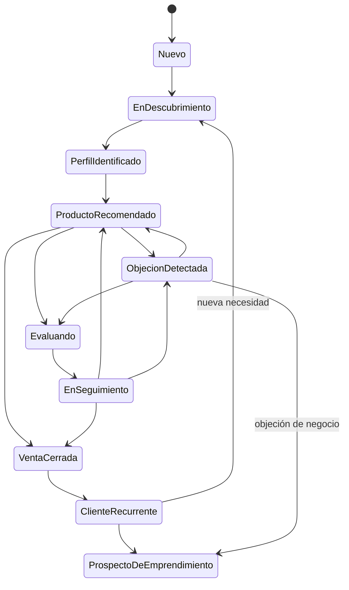

# Estados del Cliente

[🏠 Índice de Proceso de Venta](./README.md)

Modelo de estados para que la IA (o el asesor) siempre sepa **en qué punto del proceso está un cliente concreto**, incluso si la conversación se retoma días después. Cada estado indica cómo se detecta, qué módulo consultar (resumen — ver [`reglas_de_decision.md`](./reglas_de_decision.md#tabla-4-estado-del-cliente-y-módulo-prioritario) para la tabla completa) y a qué estados puede pasar desde ahí.

## Diagrama de transiciones

## Los 10 estados

### 1. Nuevo
**Definición:** el cliente tuvo el primer contacto, o retoma contacto después de mucho tiempo sin conversación activa.
**Cómo se detecta:** es la primera vez que escribe, o no hay historial de conversación reciente.
**Módulo a consultar:** [`docs/conversaciones/primer_contacto/`](../conversaciones/primer_contacto/index.md); calificar con [`calificacion_del_cliente.md`](./calificacion_del_cliente.md).
**Transiciones válidas:** → `En descubrimiento`.

### 2. En descubrimiento
**Definición:** se están haciendo preguntas para identificar su necesidad; todavía no se recomienda nada.
**Cómo se detecta:** el cliente respondió al primer contacto y está contestando preguntas abiertas.
**Módulo a consultar:** [`docs/conversaciones/descubrimiento/`](../conversaciones/descubrimiento/index.md); reglas en [`descubrimiento.md`](./descubrimiento.md).
**Transiciones válidas:** → `Perfil identificado`. (Si el cliente menciona una condición médica, se atiende de inmediato vía Tabla 2 de [`reglas_de_decision.md`](./reglas_de_decision.md) antes de continuar.)

### 3. Perfil identificado
**Definición:** ya se determinó a qué perfil de [`docs/clientes/`](../clientes/README.md) corresponde el cliente.
**Cómo se detecta:** las respuestas de descubrimiento calzan claramente con la tabla de señales.
**Módulo a consultar:** la ficha específica del perfil en `docs/clientes/`.
**Transiciones válidas:** → `Producto recomendado`.

### 4. Producto recomendado
**Definición:** se presentaron 1-2 productos concretos al cliente.
**Cómo se detecta:** el asesor ya envió una recomendación siguiendo [`recomendacion.md`](./recomendacion.md).
**Módulo a consultar:** esperar la reacción del cliente; ver Tabla 3 de [`reglas_de_decision.md`](./reglas_de_decision.md).
**Transiciones válidas:** → `Objeción detectada` (si duda) · → `Evaluando` (si pide tiempo sin objeción específica) · → `Venta cerrada` (si acepta de inmediato).

### 5. Objeción detectada
**Definición:** el cliente expresó una duda, resistencia o pregunta difícil.
**Cómo se detecta:** coincide con alguna fila de la Tabla 2 de [`reglas_de_decision.md`](./reglas_de_decision.md).
**Módulo a consultar:** [`docs/objeciones/`](../objeciones/README.md) + [`manejo_de_objeciones.md`](./manejo_de_objeciones.md).
**Transiciones válidas:** → `Evaluando` (objeción resuelta, cliente aún decidiendo) · → `Producto recomendado` (objeción resuelta, se retoma la recomendación) · → `Prospecto de emprendimiento` (si la objeción era de la rama negocio, ej. "no me gustan las ventas").

### 6. Evaluando
**Definición:** el cliente tiene la información completa (producto + objeciones resueltas) pero no ha decidido todavía.
**Cómo se detecta:** no hay una objeción activa sin resolver, pero tampoco una decisión de compra.
**Módulo a consultar:** [`seguimiento.md`](./seguimiento.md).
**Transiciones válidas:** → `En seguimiento`.

### 7. Venta cerrada
**Definición:** el cliente confirmó la compra.
**Cómo se detecta:** dio una señal explícita de decisión (ver [`cierre.md`](./cierre.md)) y se completó la secuencia de cierre.
**Módulo a consultar:** [`docs/conversaciones/cierre/`](../conversaciones/cierre/index.md), luego [`postventa.md`](./postventa.md).
**Transiciones válidas:** → `Cliente recurrente`.

### 8. En seguimiento
**Definición:** se está esperando respuesta del cliente en uno de los tiempos definidos (24h/3d/7d/15d/30d).
**Cómo se detecta:** pasó a `Evaluando` y ya se envió al menos un mensaje de seguimiento.
**Módulo a consultar:** [`docs/conversaciones/seguimiento/`](../conversaciones/seguimiento/index.md), según la tabla de [`seguimiento.md`](./seguimiento.md).
**Transiciones válidas:** → `Producto recomendado` (retoma interés) · → `Objeción detectada` (surge una nueva) · → `Venta cerrada` (decide comprar).

### 9. Cliente recurrente
**Definición:** el cliente ya compró al menos una vez y tuvo una experiencia de postventa positiva.
**Cómo se detecta:** se completó [`docs/conversaciones/postventa/verificar_satisfaccion.md`](../conversaciones/postventa/verificar_satisfaccion.md) con resultado positivo.
**Módulo a consultar:** [`postventa.md`](./postventa.md) (venta cruzada, testimonio, referido).
**Transiciones válidas:** → `En descubrimiento` (si trae una necesidad nueva y distinta) · → `Prospecto de emprendimiento` (si da una señal de interés en el negocio).

### 10. Prospecto de emprendimiento
**Definición:** el cliente mostró interés explícito en la oportunidad de negocio, más allá del consumo de producto.
**Cómo se detecta:** cumple alguna de las señales listadas en [`emprendimiento.md`](./emprendimiento.md).
**Módulo a consultar:** [`docs/clientes/emprendimiento.md`](../clientes/emprendimiento.md) + [`docs/conversaciones/emprendimiento/`](../conversaciones/emprendimiento/index.md).
**Transiciones válidas:** puede convivir en paralelo con `Cliente recurrente` — un prospecto de negocio sigue siendo cliente de producto al mismo tiempo.

## Regla general de uso de este modelo

- Un cliente solo tiene **un estado activo a la vez** dentro del embudo de producto (estados 1-9), aunque puede tener adicionalmente el estado 10 en paralelo.
- Ante ambigüedad sobre en qué estado está un cliente, usar el estado **más conservador** (el más temprano en el embudo) — es preferible repetir una pregunta de descubrimiento que recomendar sin base.
- Este modelo es de uso interno del sistema de decisión — no se le menciona al cliente ("estás en estado de evaluación") en ninguna conversación real.

---
[🏠 Índice de Proceso de Venta](./README.md)
