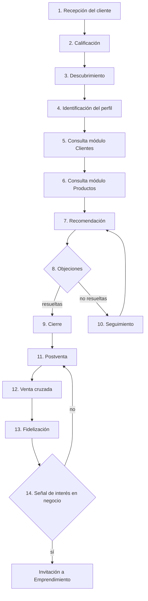

# Flujo General del Proceso de Venta

[🏠 Índice de Proceso de Venta](./README.md)

El recorrido completo, de principio a fin. Cada paso indica **qué debe ocurrir**, **qué módulo consultar** y **con qué estado de [`estados_del_cliente.md`](./estados_del_cliente.md) se corresponde**.

## Los 14 pasos

### 1. Recepción del cliente
**Qué ocurre:** el cliente escribe por primera vez (o retoma contacto) por algún canal.
**Módulo a consultar:** [`docs/conversaciones/primer_contacto/`](../conversaciones/primer_contacto/index.md), según el canal de entrada.
**Estado resultante:** `Nuevo` (ver [`estados_del_cliente.md`](./estados_del_cliente.md)).

### 2. Calificación
**Qué ocurre:** se evalúa qué tan listo está el cliente para avanzar (frío / tibio / caliente).
**Módulo a consultar:** [`calificacion_del_cliente.md`](./calificacion_del_cliente.md) (este módulo).
**Estado resultante:** sigue en `Nuevo`, pero ya con un nivel de calificación asignado.

### 3. Descubrimiento
**Qué ocurre:** se hacen preguntas abiertas para entender la necesidad real. **Nunca se recomienda producto en este paso.**
**Módulo a consultar:** [`docs/conversaciones/descubrimiento/`](../conversaciones/descubrimiento/index.md) para las preguntas; reglas en [`descubrimiento.md`](./descubrimiento.md) (este módulo).
**Estado resultante:** `En descubrimiento`.

### 4. Identificación del perfil
**Qué ocurre:** con las respuestas del cliente, se determina a qué perfil de necesidad corresponde.
**Módulo a consultar:** tabla señal→perfil en [`docs/clientes/README.md#mapa-rápido-necesidad--primer-producto-de-entrada`](../clientes/README.md#mapa-rápido-necesidad--primer-producto-de-entrada), o su equivalente en conversación en [`docs/conversaciones/descubrimiento/senales_por_perfil.md`](../conversaciones/descubrimiento/senales_por_perfil.md).
**Estado resultante:** `Perfil identificado`.

### 5. Consulta del módulo Clientes
**Qué ocurre:** se abre la ficha completa del perfil identificado para ver sus productos recomendados, objeciones típicas, argumentos de venta y prioridad de negocio.
**Módulo a consultar:** [`docs/clientes/`](../clientes/README.md) — el archivo específico del perfil.
**Regla:** este paso es **obligatorio antes** del paso 6. Nunca se salta directo a productos.

### 6. Consulta del módulo Productos
**Qué ocurre:** ya con el perfil abierto, se consultan las fichas de los 1-3 productos que ese perfil recomienda, para tener el detalle exacto de ingredientes, beneficios y presentación.
**Módulo a consultar:** [`docs/productos.md`](../productos.md), solo los productos que el perfil del paso 5 ya señaló.

### 7. Recomendación
**Qué ocurre:** se presenta 1-2 productos al cliente (nunca el catálogo completo), en lenguaje conversacional.
**Módulo a consultar:** [`docs/conversaciones/recomendacion/`](../conversaciones/recomendacion/index.md) si existe un archivo para ese perfil; si no, adaptar desde la ficha de `docs/clientes/`. Reglas completas en [`recomendacion.md`](./recomendacion.md).
**Estado resultante:** `Producto recomendado`.

### 8. Manejo de objeciones
**Qué ocurre:** el cliente muestra alguna resistencia, duda o pregunta difícil.
**Módulo a consultar:** [`docs/objeciones/`](../objeciones/README.md) para entender la objeción, [`docs/conversaciones/objeciones/`](../conversaciones/objeciones/index.md) para el diálogo. Reglas de cuándo y cómo en [`manejo_de_objeciones.md`](./manejo_de_objeciones.md).
**Estado resultante:** `Objeción detectada` → tras resolverla, `Evaluando`.

### 9. Cierre
**Qué ocurre:** el cliente da señales claras de decisión y se confirma el pedido, pago y envío.
**Módulo a consultar:** [`docs/conversaciones/cierre/`](../conversaciones/cierre/index.md). Reglas de cuándo intentarlo en [`cierre.md`](./cierre.md).
**Estado resultante:** `Venta cerrada`.

### 10. Seguimiento
**Qué ocurre:** si el cliente no cierra de inmediato (objeción no resuelta, pidió tiempo, no respondió), se retoma contacto en un momento posterior sin presionar.
**Módulo a consultar:** [`docs/conversaciones/seguimiento/`](../conversaciones/seguimiento/index.md), eligiendo el tiempo correcto según [`seguimiento.md`](./seguimiento.md).
**Estado resultante:** `En seguimiento` → si responde, regresa al paso 7 (Recomendación) o 8 (Objeciones) según corresponda.

### 11. Postventa
**Qué ocurre:** el cliente ya recibió su pedido; se verifica su satisfacción.
**Módulo a consultar:** [`docs/conversaciones/postventa/`](../conversaciones/postventa/index.md). Reglas en [`postventa.md`](./postventa.md).
**Estado resultante:** `Cliente recurrente` (si la experiencia es positiva) o vuelta a `Objeción detectada` si reporta un problema (tratar como objeción, no ignorar).

### 12. Venta cruzada
**Qué ocurre:** con satisfacción confirmada, se ofrece un producto complementario relacionado al perfil original.
**Módulo a consultar:** sección "Posibles ventas futuras (cross-selling)" del perfil en `docs/clientes/`, ejecutada con [`docs/conversaciones/postventa/recomendar_complementarios.md`](../conversaciones/postventa/recomendar_complementarios.md).

### 13. Fidelización
**Qué ocurre:** se solicita testimonio y/o recomendación (referido), consolidando la relación a largo plazo.
**Módulo a consultar:** [`docs/conversaciones/postventa/solicitar_testimonio.md`](../conversaciones/postventa/solicitar_testimonio.md).

### 14. Invitación al emprendimiento (cuando aplique)
**Qué ocurre:** **solo si** el cliente dio una señal explícita de interés en el negocio, o recomendó el producto por su cuenta de forma espontánea.
**Módulo a consultar:** [`docs/clientes/emprendimiento.md`](../clientes/emprendimiento.md) y [`docs/conversaciones/emprendimiento/`](../conversaciones/emprendimiento/index.md). Criterios de cuándo en [`emprendimiento.md`](./emprendimiento.md) (este módulo).
**Regla:** **nunca asumir** que un cliente satisfecho quiere emprender — es una rama condicional, no un paso automático.

---
[🏠 Índice de Proceso de Venta](./README.md)
